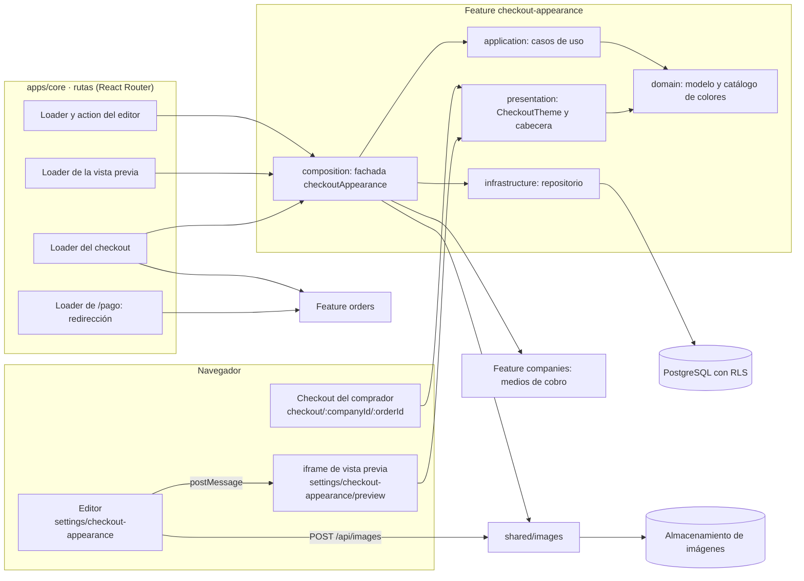
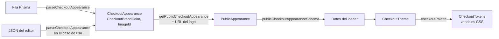
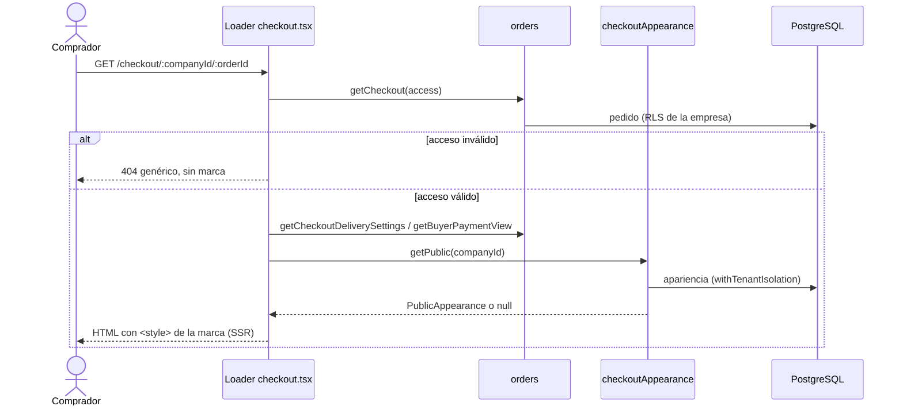
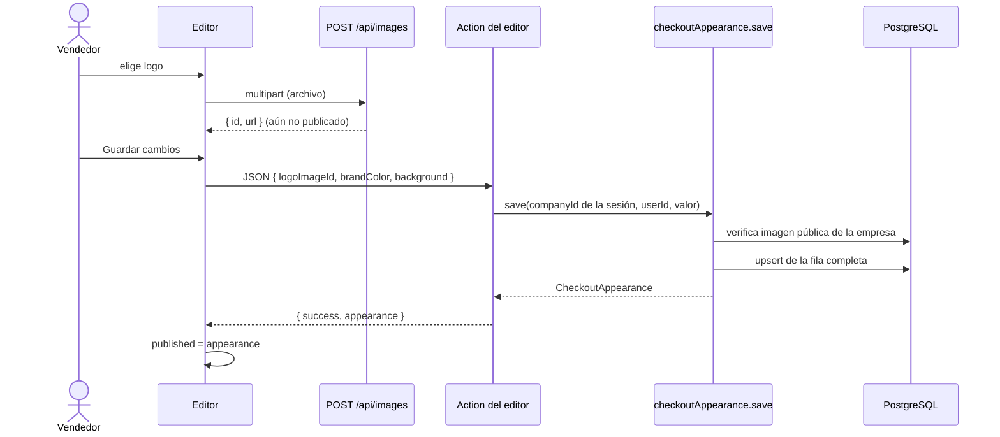
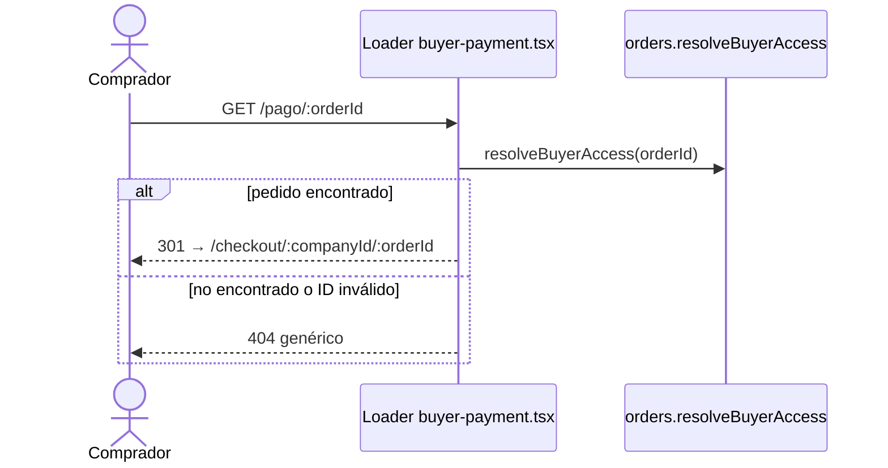

# Apariencia del checkout · Diseño técnico

Complementa la [definición de producto](apariencia-del-checkout.md). Fecha: 9 de octubre de 2026; actualizado el 10 de octubre de 2026 para usar colores predefinidos en lugar de un color HEX libre.

**Estado:** diseño definido; nada construido todavía (ver [Estado](#estado)).

Se entrega en **un solo lanzamiento**: el editor, la apariencia pública y la retirada de la página `/pago/:orderId` salen juntos. Se construye con las tareas de [apariencia-del-checkout-tareas.md](apariencia-del-checkout-tareas.md), pensadas para trabajarse en paralelo.

## 1. Decisiones de producto

| Tema | Decisión |
| --- | --- |
| Entrega | Un solo lanzamiento con todo el alcance de la especificación. |
| Límite del logo | El mismo del sistema de imágenes: hasta 10 MB. No se crea una validación específica para logos. |
| Logos animados | No se detectan; se muestran como cualquier imagen. |
| Vista previa · Pago | Muestra los medios de pago reales del negocio (billetera y banco). Si no tiene ninguno, usa ejemplos rotulados. Pedido, comprador e importes son siempre ficticios. |
| Página `/pago/:orderId` | Se elimina. El checkout ya muestra el pago después de confirmar y pasa a ser la única superficie pública del comprador. |
| Enlaces `/pago/:orderId` ya compartidos | Redirigen (301) a `/checkout/:companyId/:orderId`. Si el pedido no existe, se muestra el error genérico. |
| Rutas | En inglés, como todas las existentes. |
| Color de marca | Se elige de un catálogo cerrado de nueve colores. Cada color fija sus tonos de claro y oscuro; no hay HEX libre, cálculo de tonos ni aviso de ajuste. |
| Catálogo de colores | Vive en el código del dominio. Agregar o cambiar un color es un cambio de código revisado, no una configuración. |
| Logos subidos y descartados | Quedan almacenados sin uso. En esta versión no se limpian. |
| Concurrencia | Prevalece el último guardado completado. Sin versión ni bloqueo optimista. |

## 2. Superficies afectadas

| Superficie | Cambio |
| --- | --- |
| `/checkout/:companyId/:orderId` | Cabecera con logo y nombre. Aplica color y fondo en todos los estados del pedido. |
| `/pago/:orderId` | Se elimina la página. Queda solo una redirección al checkout. |
| Detalle del pedido (`order-detail.tsx`) | El enlace de pago abre directamente el checkout del pedido. |
| `settings/checkout-appearance` | Nuevo editor, según el mock aprobado `a4` (vista previa protagonista con colores predefinidos). |
| `settings/checkout-appearance/preview` | Página interna que se carga dentro del iframe de la vista previa. |
| Navegación privada | Nueva entrada «Apariencia del checkout» bajo Medios de cobro. |

La app móvil no cambia: sigue compartiendo el enlace de checkout.

## 3. Arquitectura

La funcionalidad se implementa como una feature nueva, `checkout-appearance`, que sigue las capas de [architecture.md](architecture.md). Las rutas existentes la consumen; las demás features no dependen de ella.

### 3.1 Mapa de módulos

```text
apps/core/prisma/
  schema.prisma                                      CompanyCheckoutAppearance + enums CheckoutBrandColor y CheckoutBackground
  migrations/20261010042649_add_company_checkout_appearance/
apps/core/src/features/checkout-appearance/
  domain/
    checkout-appearance.ts                           Tipos, valores predeterminados y validación del modelo
    checkout-colors.ts                               Catálogo de colores y checkoutPalette (puro)
  application/checkout-appearance.ts                 Casos de uso con dependencias explícitas
  infrastructure/checkout-appearance-repository.ts   Adaptador Prisma
  presentation/
    checkout-theme.tsx                               <CheckoutTheme>: variables CSS de la marca
    checkout-brand-header.tsx                        Logo + nombre con fallback
    brand-color-dialog.tsx                           Diálogo «Elige el color de tu marca»
    checkout-appearance-schemas.ts                   Esquemas Zod de las fronteras JSON internas de core
    preview-fixtures.ts                              Pedido ficticio para la vista previa
    preview-protocol.ts                              Envío y recepción de postMessage validados
  composition.ts                                     Ensambla las dependencias reales
  index.ts                                           API pública de la feature
apps/core/app/
  private-access.ts                                  Middleware de acceso privado, extraído de private-layout.tsx
  routes/checkout-appearance-settings.tsx            Editor (dentro del layout privado)
  routes/checkout-appearance-preview.tsx             Contenido del iframe (autenticado, sin layout privado)
  routes/checkout.tsx                                Aplica tema y cabecera
  routes/buyer-payment.tsx                           Queda solo como redirección
```

### 3.2 Vista de componentes



- **Rutas:** son el único punto donde se combinan `orders` y `checkout-appearance`. `orders` no conoce la apariencia y `checkout-appearance` no conoce los pedidos. El loader del checkout autoriza con `orders` y después pide la apariencia.
- **Fachada:** `checkoutAppearance` (en `composition.ts`) es la única entrada desde fuera de la feature, junto con los componentes de `presentation` y las funciones puras exportadas en `index.ts`.
- **Dependencias de otras features:** `shared/images` (validar el logo y resolver su URL) y `companies` (medios de cobro para la vista previa), siempre a través de sus `index.ts`.

### 3.3 Capas y responsabilidades

| Capa | Archivos | Responsabilidad | Puede importar | No puede importar |
| --- | --- | --- | --- | --- |
| Dominio | `domain/*` | Modelo, invariantes, valores predeterminados y catálogo de colores | `@shared/result`, `@shared/functional`, Zod (validación propia), `design-tokens.json` | Prisma, React, esquemas de presentación, otras features |
| Aplicación | `application/*` | Casos de uso; coordina validación, verificación del logo y persistencia | Dominio | Prisma, React Router, adaptadores concretos |
| Infraestructura | `infrastructure/*` | Leer y escribir la fila; traducir fallos técnicos a `Result` | Dominio, Prisma, logger | React, rutas |
| Composición | `composition.ts` | Conectar adaptadores; establecer el contexto de empresa en la lectura pública; registrar eventos | Todas las capas de la feature, `index.ts` de otras features | — |
| Presentación | `presentation/*` | Componentes de tema, cabecera y vista previa; protocolo de mensajes | Dominio (funciones puras), Zod | Infraestructura, composición |
| Rutas | `app/routes/*` | HTTP: autorizar, validar con Zod, llamar a la fachada y renderizar | Fachada, presentación (componentes y esquemas) | Repositorios directamente |

Por su tamaño, los casos de uso viven en un solo `application/checkout-appearance.ts` y sus dependencias se declaran en línea, sin `ports/`, como permite [architecture.md](architecture.md).

### 3.4 Fronteras y transformación de datos

Cada frontera valida su entrada; el tipo se fortalece hacia dentro y se reduce hacia fuera.



| Frontera | Entrada | Validación | Salida |
| --- | --- | --- | --- |
| Base → proceso | Fila de `CompanyCheckoutAppearance` | `parseCheckoutAppearance` en el repositorio; si falla, `INVALID_STORED_DATA` | `CheckoutAppearance` |
| Editor → servidor | JSON de la action | La ruta lo pasa como `unknown`; `parseCheckoutAppearance` lo valida en el caso de uso | `CheckoutAppearance` |
| Servidor → comprador | `PublicAppearance` | `publicCheckoutAppearanceSchema.parse` antes de responder | JSON solo con datos visuales |
| Editor → iframe | `postMessage` | Origen + `checkoutPreviewMessageSchema.safeParse` | Estado de la vista previa |
| Dominio → CSS | `CheckoutPalette` | Los valores salen del catálogo del código, nunca de datos del vendedor | Variables CSS |

### 3.5 Flujos

**Comprador abre el checkout**



**Vendedor guarda la apariencia**



**Vista previa en vivo**

```mermaid
sequenceDiagram
  participant E as Editor
  participant P as iframe de vista previa
  E->>P: carga settings/checkout-appearance/preview
  P->>P: loader: nombre, medios de cobro, datos ficticios
  P-->>E: checkout-appearance:ready
  loop cada cambio del borrador, modo o estado
    E->>P: checkout-appearance:update
    P->>P: valida origen y esquema; toma la paleta del catálogo; aplica .dark
  end
```

**Enlace antiguo `/pago/:orderId`**



### 3.6 Contexto de empresa y transacciones

`withTenantIsolation(companyId, …)` no abre una transacción: fija la empresa en el contexto asíncrono, y cada consulta aplica `app.company_id`, que es lo que evalúa RLS. Además, impide cambiar de empresa dentro de una transacción ya abierta.

| Operación | Contexto de empresa | Atomicidad |
| --- | --- | --- |
| Loader y action del editor | Middleware privado: `withTenantIsolation(access.company.id)` | El `upsert` es una sola sentencia; no hace falta `withinTransaction` |
| Lectura pública | `checkoutAppearance.getPublic` envuelve en `withTenantIsolation(companyId)`, después de autorizar el pedido | Una consulta de lectura |
| Vista previa | Middleware privado | Consultas de lectura independientes |

La lectura pública es independiente de la del pedido. Si un vendedor guarda justo entre ambas, el comprador ve la apariencia nueva con el pedido leído un instante antes. Es aceptable porque la apariencia no afecta importes ni estados.

### 3.7 Renderizado y tema

- **Servidor:** el checkout se renderiza en el servidor con el `<style>` de la marca dentro del HTML. No hay destello de la apariencia de Yoyos antes de aplicar la marca.
- **Hidratación:** `checkoutPalette` es una consulta al catálogo, así que servidor y navegador producen el mismo CSS y no hay diferencias al hidratar.
- **Modo oscuro:** el script actual de `root.tsx` aplica `.dark` antes de pintar. El `<style>` ya trae las dos variantes (`[data-checkout-theme="…"]` y `.dark [data-checkout-theme="…"]`), por lo que el cambio de modo no requiere JavaScript adicional.
- **Catálogo en el navegador:** el editor lo usa para las muestras del diálogo y del inspector, y el iframe para aplicar el borrador. El costo en el paquete es una tabla de nueve colores.
- **Persistencia:** se guarda el identificador del color y el fondo, no los tonos. Un ajuste de tonos en el catálogo se aplica a todas las empresas que usan ese color sin migrar datos.

### 3.8 Decisiones de arquitectura

| Decisión | Alternativas descartadas | Motivo |
| --- | --- | --- |
| Feature nueva `checkout-appearance` | Dentro de `companies` u `orders` | Tiene modelo, reglas y pruebas propios; `orders` no debe depender de la apariencia |
| Tabla dedicada con columnas tipadas | JSON en `CompanyPaymentSettings` o una columna JSON nueva | La base valida los enums y la propiedad del logo (FK compuesta); no hay JSON que validar al leer |
| Catálogo cerrado de colores con tonos fijos | HEX libre con tonos derivados (OKLCH) | Contraste verificado de antemano para cada color; sin algoritmo de ajuste ni avisos; la UI solo ofrece opciones válidas |
| Guardar el identificador del color | Guardar sus HEX o los tokens | Una sola fuente de verdad; ajustar un color del catálogo no requiere migrar datos |
| Variables CSS con alcance `[data-checkout-theme]` | Reescribir el tema global o añadir clases por color | El checkout ya usa los tokens; el panel privado queda aislado |
| Vista previa en iframe | Container queries; renderizar dentro del editor | El iframe tiene su propio viewport y activa los breakpoints reales sin reescribir el checkout |
| Apariencia en un campo propio del loader | Agregarla a `publicCheckoutSchema` | Las respuestas de la action de confirmación no la necesitan y el contrato del pedido no cambia |
| Lectura pública tolerante a fallos (`null`) | Propagar el error | Una falla visual no debe impedir confirmar ni pagar |
| Sin versión ni bloqueo optimista | `version` como en `CompanyDeliverySettings` | Es una configuración visual completa: prevalece el último guardado y no hay datos que fusionar |
| Middleware privado extraído a `app/private-access.ts` | Duplicarlo en la ruta de la vista previa | Una sola implementación de la autorización |

## 4. Persistencia

### 4.1 Esquema Prisma

```prisma
enum CheckoutBrandColor {
  yoyos
  forest
  petrol
  ocean
  plum
  raspberry
  terracotta
  mustard
  graphite
}

enum CheckoutBackground {
  white
  neutral
  brand_tint
}

model CompanyCheckoutAppearance {
  companyId    String @id @default(dbgenerated("(NULLIF(current_setting('app.company_id'::text, true), ''::text))::uuid")) @db.Uuid
  company      Company @relation(fields: [companyId], references: [id], onDelete: Cascade)
  logoImageId  String? @db.Uuid
  logoImage    Image? @relation(fields: [companyId, logoImageId], references: [companyId, id])
  brandColor   CheckoutBrandColor
  background   CheckoutBackground
  updatedAt    DateTime @updatedAt
}
```

La migración la genera `prisma migrate dev --create-only`, siguiendo `.agents/skills/database-migrations/SKILL.md`. Quién guardó no se persiste: queda en el log `checkout_appearance_saved`.

### 4.2 SQL añadido a la migración generada

```sql
ALTER TABLE "CompanyCheckoutAppearance" ENABLE ROW LEVEL SECURITY;
ALTER TABLE "CompanyCheckoutAppearance" FORCE ROW LEVEL SECURITY;
CREATE POLICY company_checkout_appearance_isolation ON "CompanyCheckoutAppearance"
  USING ("companyId" = NULLIF(current_setting('app.company_id', true), '')::uuid)
  WITH CHECK ("companyId" = NULLIF(current_setting('app.company_id', true), '')::uuid);
```

### 4.3 Invariantes garantizadas por la base

| Invariante | Mecanismo |
| --- | --- |
| Una apariencia por empresa | PK `companyId` |
| Solo la empresa del contexto lee o escribe | RLS `FORCE` con `app.company_id` |
| El logo es una imagen de la misma empresa | FK compuesta `(companyId, logoImageId) → Image(companyId, id)` |
| Una imagen en uso como logo no se puede borrar | FK `ON DELETE RESTRICT` |
| Solo colores y fondos del catálogo | Enums `CheckoutBrandColor` y `CheckoutBackground` |
| La apariencia se borra con la empresa | `ON DELETE CASCADE` |

La migración no bloquea tablas existentes: crea una tabla y dos enums nuevos, y solo añade una FK hacia `Image` desde esa tabla vacía. No toca datos.

### 4.4 Ciclo de vida de la fila

| Evento | Operación |
| --- | --- |
| Empresa sin personalizar | No hay fila; se usa la apariencia de Yoyos |
| Guardar | `upsert` de la fila completa en una sola sentencia; nunca hay escrituras parciales |
| Restablecer y guardar | `upsert` con `defaultCheckoutAppearance`; la fila no se borra |
| Quitar el logo y guardar | `logoImageId = NULL` |

**Cambios del catálogo.** Ajustar los tonos de un color existente solo cambia `checkout-colors.ts`. Agregar un color requiere una migración que añada el valor al enum. Retirar un color requiere una migración que primero pase sus filas a `yoyos` y después quite el valor; mientras tanto, el dominio trata un identificador desconocido como dato inválido y el comprador ve la apariencia predeterminada.

## 5. Dominio y tipos

### 5.1 Identificadores y valores

Cada feature declara sus propios tipos marcados (*branded types*), como ya hacen `orders` y `products`:

```ts
export type CompanyId = string & { readonly __brand: "CompanyId" };
export type ImageId = string & { readonly __brand: "ImageId" };
export type HexColor = string & { readonly __brand: "HexColor" };   // solo para los tonos del catálogo
export const checkoutBrandColors = ["yoyos", "forest", "petrol", "ocean", "plum", "raspberry", "terracotta", "mustard", "graphite"] as const;
export type CheckoutBrandColor = (typeof checkoutBrandColors)[number];
export type CheckoutBackground = "white" | "neutral" | "brand_tint";

export type CheckoutAppearance = Readonly<{
  logoImageId: ImageId | null;
  brandColor: CheckoutBrandColor;
  background: CheckoutBackground;
}>;

export type CheckoutAppearanceError = Readonly<{ code: "INVALID_CHECKOUT_APPEARANCE"; message: string }>;

export const defaultCheckoutAppearance: CheckoutAppearance; // sin logo, "yoyos", "neutral"
export function parseCheckoutAppearance(value: unknown): Result<CheckoutAppearance, CheckoutAppearanceError>;
```

`parseCheckoutAppearance` es la única forma de construir un `CheckoutAppearance` a partir de datos externos: valida que el color y el fondo pertenezcan al catálogo y aplica los *brands*; no acepta HEX. Se usa en dos puntos: al entrar al caso de uso y al leer una fila de la base, que también es un dato externo al proceso. `HexColor` solo tipa las constantes del catálogo, escritas en el código.

### 5.2 Catálogo de colores

```ts
export type CheckoutTokens = Readonly<{
  primary: HexColor; "primary-foreground": HexColor; "primary-hover": HexColor; "primary-pressed": HexColor;
  ring: HexColor; accent: HexColor; "accent-foreground": HexColor; "brand-background": HexColor;
}>;
export type BrandColorDefinition = Readonly<{ name: string; light: CheckoutTokens; dark: CheckoutTokens }>;
export type CheckoutPalette = Readonly<{ light: CheckoutTokens & { background: HexColor }; dark: CheckoutTokens & { background: HexColor } }>;

export const checkoutBrandColorCatalog: Readonly<Record<CheckoutBrandColor, BrandColorDefinition>>;
export function checkoutPalette(brandColor: CheckoutBrandColor, background: CheckoutBackground): CheckoutPalette;
```

Las claves coinciden con `docs/design-tokens.json`. El checkout ya usa `bg-primary`, `text-primary`, `ring` y `bg-accent`, así que no hace falta cambiar sus clases. No se tocan `card`, `border`, `input`, `muted*` ni los colores semánticos (`success`, `warning`, `error`, `destructive`).

**Catálogo.** Cada color define a mano todos sus tokens en ambos modos. Los cuatro tonos base son los de la [definición de producto](apariencia-del-checkout.md#colores-disponibles):

| Id | Nombre | `light.primary` | `light.brand-background` | `dark.primary` | `dark.brand-background` |
| --- | --- | --- | --- | --- | --- |
| `yoyos` | Yoyos | `#8C552D` | `#F7EFE6` | `#D5A16C` | `#1F1B19` |
| `forest` | Bosque | `#2F6B4F` | `#F1F6F2` | `#8FCBA8` | `#181E1B` |
| `petrol` | Petróleo | `#13646B` | `#EEF6F6` | `#84CBD0` | `#161E1F` |
| `ocean` | Océano | `#1F5A8C` | `#EFF4FA` | `#8EBDE6` | `#171C22` |
| `plum` | Ciruela | `#6B3A7D` | `#F6F1F8` | `#C9A2D8` | `#1E1921` |
| `raspberry` | Frambuesa | `#A8305F` | `#FBF0F4` | `#EE9BBB` | `#221A1D` |
| `terracotta` | Terracota | `#A4452A` | `#FBF2EE` | `#EDA38A` | `#221B19` |
| `mustard` | Mostaza | `#7E5C00` | `#FAF5E6` | `#E3C063` | `#201E17` |
| `graphite` | Grafito | `#333238` | `#F4F4F5` | `#C9C7CF` | `#1C1C1E` |

El resto de tokens se fija en T0 con estas reglas, y los tests del catálogo las comprueban:

- **`primary-foreground`:** el del sistema en cada modo: blanco en claro, casi negro en oscuro.
- **`primary-hover` y `primary-pressed`:** variantes del mismo tono con diferencia mínima de 1,15:1 y 1,3:1 respecto de `primary`, conservando 4,5:1 con `primary-foreground`.
- **`ring`:** igual a `primary`, que ya supera 3:1 sobre las superficies.
- **`accent`:** superficie de selección clara (claro) u oscura (oscuro) del tono de la marca; **`accent-foreground`:** un tono de la marca con 4,5:1 sobre `accent`.
- **`primary` como texto:** se usa también en enlaces e iconos, así que debe alcanzar 4,5:1 contra `card`, `background` del sistema y su `brand-background`.

`checkoutPalette` resuelve el fondo de cada modo: Blanco es `#FFFFFF` en claro; Neutro, el `background` del sistema; De marca (`brand_tint`), el `brand-background` del color. En oscuro, Blanco y Neutro usan el `background` oscuro del sistema.

`checkoutBrandColorCatalog` es la única fuente de tonos. No hay conversión de espacios de color ni ajuste en tiempo de ejecución; el cálculo de contraste solo existe en los tests.

## 6. Esquemas de las fronteras JSON

No se crea un contrato en `shared/contracts/`: esa carpeta es para contratos entre aplicaciones (core ↔ mobile), y la app móvil no usa la apariencia. Los esquemas viven en `presentation/checkout-appearance-schemas.ts` dentro de la feature, como en `chats/presentation/*-schemas.ts`.

Solo hay esquemas donde hay una frontera JSON que no cubre el dominio:

```ts
// Servidor → comprador: solo datos visuales
export const publicCheckoutAppearanceSchema = z.strictObject({
  logoUrl: httpUrl.nullable(),
  brandColor: z.enum(checkoutBrandColors),
  background: z.enum(["white", "neutral", "brand_tint"]),
});

// Editor → iframe de vista previa
export const checkoutPreviewMessageSchema = z.strictObject({
  type: z.literal("checkout-appearance:update"),
  appearance: publicCheckoutAppearanceSchema,
  mode: z.enum(["light", "dark"]),
  state: z.enum(["review", "payment"]),
});

// Iframe → editor: listo para recibir el estado
export const checkoutPreviewReadySchema = z.strictObject({ type: z.literal("checkout-appearance:ready") });
```

- **Entrada del editor:** no tiene esquema de transporte propio. La action pasa el JSON como `unknown` a `checkoutAppearance.save`, y `parseCheckoutAppearance` del dominio lo valida y normaliza. Un segundo esquema solo duplicaría esa regla.
- Los tipos se infieren con `z.infer`; no hay DTOs escritos a mano.
- La apariencia pública **no** se agrega a `publicCheckoutSchema`. Viaja en un campo propio de los datos del loader del checkout (`PageData.appearance`), porque las respuestas de la action de confirmación no la necesitan.
- `postMessage` es una frontera JSON. Ambos lados validan con `safeParse` y descartan cualquier mensaje cuyo `event.origin` no sea `window.location.origin`.

## 7. Casos de uso

Viven en `application/checkout-appearance.ts`. Reciben sus dependencias como argumento y devuelven `Result`.

```ts
type CheckoutAppearanceFailure = CheckoutAppearanceError
  | Readonly<{ code: "INVALID_IMAGE" | "INVALID_STORED_DATA" | "PERSISTENCE_UNAVAILABLE"; message: string }>;

type AppearanceDependencies = Readonly<{
  load: (companyId: CompanyId) => Promise<Result<CheckoutAppearance | null, CheckoutAppearanceFailure>>;
  save: (companyId: CompanyId, appearance: CheckoutAppearance) => Promise<Result<null, CheckoutAppearanceFailure>>;
  imageAvailable: (companyId: CompanyId, imageId: ImageId) => Promise<Result<boolean, CheckoutAppearanceFailure>>;
  imageUrl: (imageId: ImageId) => Promise<Result<string | null, Readonly<{ message: string }>>>;
}>;
```

| Caso de uso | Entrada | Salida | Errores | Autorización |
| --- | --- | --- | --- | --- |
| `getCheckoutAppearance` | `companyId` | `CheckoutAppearance \| null` | `INVALID_STORED_DATA`, `PERSISTENCE_UNAVAILABLE` | Contexto privado (middleware) |
| `saveCheckoutAppearance` | `companyId`, `unknown` | `CheckoutAppearance` | `INVALID_CHECKOUT_APPEARANCE`, `INVALID_IMAGE`, `PERSISTENCE_UNAVAILABLE` | Contexto privado; el `companyId` sale de la sesión, nunca del formulario |
| `getPublicCheckoutAppearance` | `companyId` | `PublicAppearanceResult` | Ninguno: una falla devuelve `{ kind: "fallback" }`, y si falla el logo, `logoUrl: null` | Solo después de autorizar el acceso al pedido |
| `getCheckoutAppearancePreview` | `companyId` | `{ companyName, appearance, logoUrl, paymentSettings }` | `PERSISTENCE_UNAVAILABLE` | Contexto privado |

```ts
type PublicAppearanceResult =
  | Readonly<{ kind: "default" }>                                   // sin apariencia guardada
  | Readonly<{ kind: "custom"; appearance: PublicAppearance }>
  | Readonly<{ kind: "fallback" }>;                                 // lectura fallida o datos inválidos
```

`default` y `fallback` se ven igual para el comprador (apariencia de Yoyos), pero se distinguen en la observabilidad (12.2).

Reglas de `saveCheckoutAppearance`:

1. Valida con `parseCheckoutAppearance`; un color fuera del catálogo se rechaza.
2. Si hay `logoImageId`, `imageAvailable` comprueba que la imagen existe en el contexto de la empresa (RLS) y que es `public`.
3. `save` hace el `upsert` completo.
4. Devuelve la apariencia guardada, que pasa a ser la nueva versión publicada del editor.

La FK compuesta repite a nivel de base la comprobación del paso 2.

`composition.ts` expone la fachada:

```ts
checkoutAppearance.get(companyId)
checkoutAppearance.save(companyId, userId, value)   // registra checkout_appearance_saved
checkoutAppearance.getPublic(companyId)             // envuelve en withTenantIsolation(companyId)
checkoutAppearance.getPreview(companyId)            // apariencia + companyPaymentSettings.get + URLs de imágenes
```

`imageAvailable` lanza una excepción si `getCompanyId()` no coincide con el `companyId` recibido. Es un error de programación, no un `Result`, igual que en `companyPaymentSettings`.

## 8. Subida del logo

Se reutiliza `POST /api/images` sin cambios:

- Validación por contenido real: PNG/JPG/WEBP, hasta 10 MB y 8000 px por lado.
- La imagen se crea con visibilidad `public`; el editor avisa que el logo es visible para los compradores.
- El navegador comprueba tipo y tamaño antes de subir para responder al instante, pero el servidor es la fuente de verdad.
- La subida no publica nada: solo devuelve `{ id, url }` para el borrador. Al guardar, el caso de uso vuelve a verificar el logo.

## 9. Errores y su traducción

| Código | Origen | Editor (action) | Checkout público |
| --- | --- | --- | --- |
| `INVALID_CHECKOUT_APPEARANCE` | Validación | 422 · error junto al control | — |
| `INVALID_IMAGE` | Logo ajeno, privado o inexistente | 422 · «No pudimos usar ese logo. Súbelo de nuevo.» | — |
| `INVALID_STORED_DATA` | Fila corrupta | 503 · «No se pudo cargar la apariencia» | Apariencia predeterminada |
| `PERSISTENCE_UNAVAILABLE` | Base de datos | 503 · reintentar, conservando el borrador | Apariencia predeterminada |
| Subida: `INVALID_IMAGE` / `IMAGE_TOO_LARGE` | `POST /api/images` | Error bajo el control del logo; lo publicado no cambia | — |

## 10. Presentación

### 10.1 Tema del checkout

```tsx
type CheckoutThemeProps = Readonly<{ appearance: PublicCheckoutAppearance | null; children: ReactNode }>;
```

- Con `appearance === null` no emite estilos: el checkout se ve exactamente como hoy.
- En otro caso, obtiene `checkoutPalette(brandColor, background)` y renderiza:

  ```html
  <style>[data-checkout-theme="…"]{--primary:#…;…}.dark [data-checkout-theme="…"]{--primary:#…;…}</style>
  <div data-checkout-theme="…" class="min-h-screen bg-background text-foreground">…</div>
  ```

- El valor del atributo lo genera `useId`: cada instancia aplica sus variables solo a su subárbol, y servidor y navegador producen el mismo valor.
- Los valores salen siempre del catálogo escrito en el código. Nunca se interpola texto del usuario en el CSS.
- Al limitar el alcance a `[data-checkout-theme]`, la marca no afecta al panel privado.

### 10.2 Cabecera

```tsx
type CheckoutBrandHeaderProps = Readonly<{ companyName: string; logoUrl: string | null }>;
```

- El logo va en una caja de hasta 40 × 160 px, con `object-contain` y una superficie clara neutra en ambos modos.
- Lleva `alt=""`, porque el nombre ya aparece al lado.
- Si la imagen falla (`onError`), se oculta y queda solo el nombre.

### 10.3 `routes/checkout.tsx`

```ts
type PageData = { …actual; appearance?: PublicCheckoutAppearance | null };
```

En el loader, después de un `orders.getCheckout(access)` exitoso, se llama a `checkoutAppearance.getPublic(access.companyId)`, en paralelo con la configuración de entrega y la vista de pago. El loader etiqueta la solicitud con `checkoutAppearance: result.kind`. Si es `custom`, valida la apariencia con `publicCheckoutAppearanceSchema` (respuesta propia) y la pone en `appearance`; en otro caso, `appearance: null`.

En la página:

- Todo el contenido se envuelve en `<CheckoutTheme>`.
- La cabecera actual se reemplaza por `<CheckoutBrandHeader>`.
- Se mantienen `Cache-Control: no-store` y `Referrer-Policy: no-referrer`, así que recargar muestra la última apariencia publicada.
- El `ErrorBoundary` no recibe ni muestra la marca.

### 10.4 `routes/buyer-payment.tsx` (retirada)

```ts
export async function loader({ params }: LoaderFunctionArgs) {
  const access = await orders.resolveBuyerAccess(params.orderId ?? "");
  if (access.success) throw redirect(`/checkout/${access.data.companyId}/${access.data.orderId}`, 301);
  throw new Response("Pedido no disponible", { status: access.error.code === "PERSISTENCE_UNAVAILABLE" ? 503 : 404 });
}
```

- Se conservan el `ErrorBoundary` genérico y las cabeceras `no-store` y `no-referrer`. Se elimina el componente de página.
- `order-detail.tsx` enlaza directamente a `/checkout/:companyId/:orderId` y se ajusta el texto de `orders.buyerPaymentLink`.
- `orders.getBuyerPaymentView` y la API de comprobantes se mantienen, porque el checkout los usa.

### 10.5 Editor (`routes/checkout-appearance-settings.tsx`)

Sigue el mock aprobado `a4` ([editor](../.impeccable/mocks/checkout-editable/a4-closed-light.png), [diálogo de colores](../.impeccable/mocks/checkout-editable/a4-dialog-light.png), [registro de aprobación](../.impeccable/mocks/checkout-editable/a4.json)). El registro de superficie de Impeccable se crea al implementarlo (T5).

Se registra como `settings/checkout-appearance` en las dos ramas del layout privado (`public-*` y `localized-*`). En `private-layout.tsx` se agrega `"appearance"` a la navegación activa. Los textos van en `app/locales.ts`.

```ts
// loader
type EditorLoaderData = Readonly<{ companyName: string; published: CheckoutAppearance; logoUrl: string | null }>;
// action
type EditorActionData = { success: true; appearance: CheckoutAppearance } | { error: CheckoutAppearanceFailure["code"] };
```

Estado local del borrador:

```ts
type EditorDraft = Readonly<{ appearance: CheckoutAppearance; logoUrl: string | null }>;
type EditorActivity = { kind: "idle" } | { kind: "uploading" } | { kind: "saving" };
type EditorFailure = { kind: "upload"; code: string } | { kind: "save"; code: CheckoutAppearanceFailure["code"] } | null;

// Derivados
const dirty = !sameAppearance(draft.appearance, published);
const canSave = dirty && activity.kind === "idle";
```

- **Color:** una fila con una sola muestra del modo activo en la vista previa (`light.primary` o `dark.primary`), el nombre del color, «Tono para modo claro/oscuro» y «Cambiar». Abre `<BrandColorDialog>`.
- **Diálogo de colores:** `role="dialog"` con título «Elige el color de tu marca»; cuadrícula de 3 × 3 implementada como `radiogroup`, con una muestra del modo activo y el nombre por opción, y «Predeterminado» en Yoyos. La opción marcada lleva borde e icono de verificación. Mantiene su propia selección hasta «Usar <color>», que actualiza `draft.appearance.brandColor`; «Cancelar», cerrar y Escape la descartan. Foco inicial en la opción actual, flechas para moverse, devolución del foco a la fila al cerrar.
- **Fondo:** control segmentado Blanco / Neutro / De marca. Con De marca, la ayuda nombra el color elegido.
- **Subida:** `POST /api/images`; si sale bien, se actualizan `draft.logoUrl` y `logoImageId`.
- **Guardar:** `fetcher.submit(appearance, { method: "post", encType: "application/json" })`. Al terminar muestra «Apariencia actualizada», y lo guardado pasa a ser la nueva versión publicada.
- **Descartar:** borrador = publicado. **Restablecer:** borrador = `defaultCheckoutAppearance`; hace falta guardar para publicarlo.
- **Salida con cambios:** `useBlocker(dirty)` muestra un diálogo con «Seguir editando» y «Descartar y salir».
- **Errores:** una subida o un guardado fallido conservan el borrador y ofrecen reintentar.
- **Celular:** una sola columna con las pestañas «Editar» y «Vista previa» sobre el mismo estado.

### 10.6 Vista previa (`routes/checkout-appearance-preview.tsx`)

- Se registra como `settings/checkout-appearance/preview` **fuera** del layout privado, pero con el mismo middleware de acceso. Para ello, el middleware se extrae de `private-layout.tsx` a `app/private-access.ts` y ambos lo reutilizan.
- **Loader:** `checkoutAppearance.getPreview(companyId)`.
- **Componentes reales:** renderiza `CheckoutForm`, `DeliverySummary` y `BuyerPaymentContent` dentro de `CheckoutTheme`.
- **Datos:** `preview-fixtures.ts` aporta un `PublicCheckoutResponse` ficticio (pendiente y confirmado) y un `BuyerPaymentView` con importes ficticios y los `settings` reales del negocio, o de ejemplo si no hay.
- **Sin action:** confirmar, pagar y subir comprobante reciben *handlers* vacíos. Además, el iframe usa `sandbox="allow-scripts allow-same-origin"` sin `allow-forms`, así que un formulario no puede enviarse aunque falle un *handler*.
- **Protocolo:** el iframe envía `ready`, y el editor responde con un `update` en cada cambio. El iframe aplica `mode` alternando `.dark` en su `<html>`, sin tocar la preferencia guardada.
- **Estados:** **Revisión** muestra el pedido pendiente con el formulario; **Pago**, el pedido confirmado con los medios de pago. La barra superior siempre indica «Vista previa · Datos de ejemplo».
- **Dimensiones:** el iframe se fija en 390 px (celular) o 1280 px (escritorio) y se escala con `transform: scale()` para caber en el lienzo. Como tiene su propio viewport, los breakpoints reales del checkout funcionan.
- **Marco:** el del teléfono es solo CSS. El contenido es el checkout real, no el del mock; las tarjetas «Tus datos / Editar» del mock eran ilustrativas.

Se descartaron las *container queries* porque obligarían a reescribir las clases responsive del checkout público.

## 11. Seguridad y privacidad

- **Escritura:** solo a través de la action del editor, con `companyId` tomado de `privateUserContext` y RLS activo.
- **Lectura pública:** solo después de un `orders.getCheckout` exitoso. Con un enlace inválido no se consulta la apariencia y no se revela la marca.
- **Respuesta al comprador:** solo `logoUrl`, `brandColor` y `background`; ni IDs ni fechas.
- **Redirección de `/pago`:** revela el `companyId` del pedido a quien tenga el enlace, el mismo acceso que daba la página eliminada.
- **CSS:** generado solo a partir del catálogo del código; el vendedor no aporta ningún valor de color.
- **Vista previa:** autenticada, sin action, con el iframe en *sandbox* y mensajes validados por origen y esquema.

## 12. Observabilidad

Logs de Pino según [logging-conventions.md](logging-conventions.md). `requestId` y `companyId` los añade el contexto de la solicitud.

### 12.1 Eventos

```jsonc
// info · después de guardar
{ "event": "checkout_appearance_saved", "requestId": "…", "companyId": "…", "userId": "…",
  "logoImageId": "…",            // solo si hay logo
  "hasLogo": true, "brandColor": "forest", "background": "brand_tint",
  "isDefault": false }

// error · repositorio
{ "event": "unable_to_load_checkout_appearance", "requestId": "…", "companyId": "…",
  "operation": "get_checkout", "errorCode": "PERSISTENCE_UNAVAILABLE", "err": { … } }

// error · repositorio
{ "event": "unable_to_save_checkout_appearance", "requestId": "…", "companyId": "…",
  "logoImageId": "…",            // solo si hay logo
  "errorCode": "PERSISTENCE_UNAVAILABLE", "err": { … } }

// error · repositorio
{ "event": "invalid_stored_checkout_appearance", "requestId": "…", "companyId": "…",
  "errorCode": "INVALID_STORED_DATA", "invalidFields": ["brandColor"] }
```

Notas:

- **`outcome`:** cada ruta nueva lo fija explícitamente, incluso cuando sale bien. Si no, el middleware infiere `invalid_input` para cualquier 200.
- **Rutas:** se normalizan `/settings/checkout-appearance`, `/settings/checkout-appearance/preview` y `/pago/:orderId` en `logger.ts`, con reglas equivalentes en `newrelic.cjs`. Sin esto, React Router las registra todas como `/{*splat}`.
- **Nunca se registran:** datos del comprador, `orderId`, URLs de imágenes, medios de cobro ni cuerpos de solicitud.

## 13. Plan de trabajo

Las tareas, pensadas para trabajarse en paralelo, están en [apariencia-del-checkout-tareas.md](apariencia-del-checkout-tareas.md).

## 14. Pruebas

Un `test` por comportamiento. Los casos marcados con *(matriz)* se repiten para cada color del catálogo × fondo × modo.

### `domain/checkout-colors.test.ts`

```ts
describe("catalog")
  test("defines every color of CheckoutBrandColor with light and dark tokens")
  test("matches the base tones of the product definition")
  test("uses Yoyos as the default color")

describe("primary color")
  test("is readable as text on the page, cards and its brand background")   // matriz
  test("keeps button text readable on primary, hover and pressed")           // matriz
  test("makes hover and pressed visibly different from primary")            // matriz

describe("focus ring")
  test("reaches 3:1 against the page and cards")                             // matriz

describe("accent surface")
  test("keeps accent and system text readable on it")                        // matriz

describe("page background")
  test("is pure white for the white option in light mode")
  test("keeps the system dark background for the white option in dark mode")
  test("keeps the system background for the neutral option")
  test("uses the brand background of the color for the brand option in both modes")
  test("keeps system text and muted text readable on it")                    // matriz
```

### `domain/checkout-appearance.test.ts`

```ts
describe("parseCheckoutAppearance")
  test("accepts a complete appearance")
  test("accepts an appearance without logo")
  test("accepts every color of the catalog")
  test("rejects %s as brand color")            // "#2F6B4F", "green", "Bosque", "", null
  test("rejects a logo id that is not a UUID")
  test("rejects a background outside the three options")
  test("rejects unknown fields")

describe("isDefaultCheckoutAppearance")
  test("recognizes the Yoyos default appearance")
  test("treats a different color, background or logo as customized")
```

### `application/checkout-appearance.test.ts`

```ts
describe("saveCheckoutAppearance")
  test("saves logo, color and background together")
  test("saves an appearance without logo without checking images")
  test("rejects a logo that is not an available image of the company and saves nothing")
  test("rejects an invalid appearance and saves nothing")
  test("returns the failure when the logo cannot be checked")
  test("returns the failure when saving fails")

describe("getPublicCheckoutAppearance")
  test("returns the custom appearance with the logo URL and no identifiers")
  test("returns default when the company has no saved appearance")
  test("returns fallback when the appearance cannot be read")
  test("keeps the appearance without logo when the logo URL cannot be resolved")
  test("returns no logo URL when the appearance has no logo")
```

### `infrastructure/checkout-appearance-repository.integration.test.ts`

```ts
describe("loadCheckoutAppearance")
  test("returns null when the company has no appearance")
  test("returns the saved appearance of the company")
  test("does not return the appearance of another company")

describe("persistCheckoutAppearance")
  test("creates the appearance on the first save")
  test("replaces the whole appearance on later saves")
  test("keeps one appearance per company")
  test("removes the logo when saved without one")
  test("rejects a logo that belongs to another company")
  test("rejects a color outside the catalog at the database")
  test("logs and returns PERSISTENCE_UNAVAILABLE when the database fails")
```

### `presentation/checkout-theme.test.tsx`

```ts
describe("CheckoutTheme")
  test("renders no styles when the company has no appearance")
  test("scopes light and dark variables to the checkout")
  test("renders only catalog colors in the style tag")

describe("CheckoutBrandHeader")
  test("shows the logo next to the company name")
  test("shows only the company name when there is no logo")
  test("hides the logo and keeps the name when the image fails to load")
```

### `presentation/preview-protocol.test.ts`

```ts
describe("preview messages")
  test("applies a valid update from the same origin")
  test("ignores messages from another origin")
  test("ignores messages that do not match the schema")
  test("announces readiness to the editor once loaded")
```

### `app/routes/checkout-appearance-settings.test.ts`

```ts
describe("editor loader")
  test("returns the published appearance and logo URL of the session company")
  test("returns the Yoyos default when the company has no appearance")

describe("editor action")
  test("saves the appearance for the session company, ignoring any company in the body")
  test("responds 422 for an invalid appearance or a color outside the catalog")
  test("responds 422 for a logo of another company")
  test("responds 503 and keeps the published appearance when saving fails")
  test("tags the request as save_checkout_appearance with its outcome")
```

### `app/routes/checkout.test.ts` (casos nuevos)

```ts
describe("checkout appearance")
  test("includes the company appearance after authorizing the order")
  test("does not read the appearance for an unauthorized link")
  test("uses the default appearance when the company has none")
  test("uses the default appearance and still loads the order when reading it fails")
  test("tags the request with default, custom or fallback appearance")
```

### `app/routes/buyer-payment.test.ts`

```ts
describe("legacy payment link")
  test("redirects permanently to the checkout of the order")
  test("responds 404 for an unknown order")
  test("responds 404 for an invalid order id")
  test("responds 503 when the order cannot be resolved")
```

### `tests/e2e/checkout-appearance.spec.ts`

```ts
describe("checkout appearance editor")
  test("shows the published appearance and a preview with sample data")
  test("updates the preview without changing the public checkout")
  test("publishes logo, color and background together when saving")
  test("applies the new appearance to a previously shared link on reload")
  test("keeps the draft and the published appearance when an upload fails")
  test("chooses a color in the dialog and shows it in the preview without publishing")
  test("keeps the previous color when the dialog is cancelled")
  test("shows the swatch of the active preview mode in the row and the dialog")
  test("restores the published appearance when discarding")
  test("requires saving to publish a reset")
  test("asks to keep editing or discard when leaving with changes")
  test("switches the preview between phone and desktop, light and dark, review and payment")
  test("never confirms orders or registers payments from the preview")
  test("can be completed with the keyboard on a phone screen")

describe("buyer checkout with appearance")
  test("shows the logo and brand colors in every order state")
  test("shows the company name when the logo fails to load")
  test("shows the generic error without branding for an unauthorized link")
  test("keeps delivery quote and payment flows working")
```

### `tests/e2e/buyer-payment.spec.ts` (reescrito)

```ts
describe("legacy payment link")
  test("opens the order checkout from the order detail")
  test("redirects an old payment link to the order checkout")
  test("shows the generic error for an unknown payment link")
```

## Estado

**Nada construido.** Al 10 de octubre de 2026 no existen en el repositorio la migración ni la feature `checkout-appearance`. El paso 1 construido con HEX y paleta derivada se revirtió al cambiar a colores predefinidos, así que no hay datos ni migraciones que adaptar desde ese modelo.

**Pendiente:** las tareas T0 a T5 de [apariencia-del-checkout-tareas.md](apariencia-del-checkout-tareas.md).
