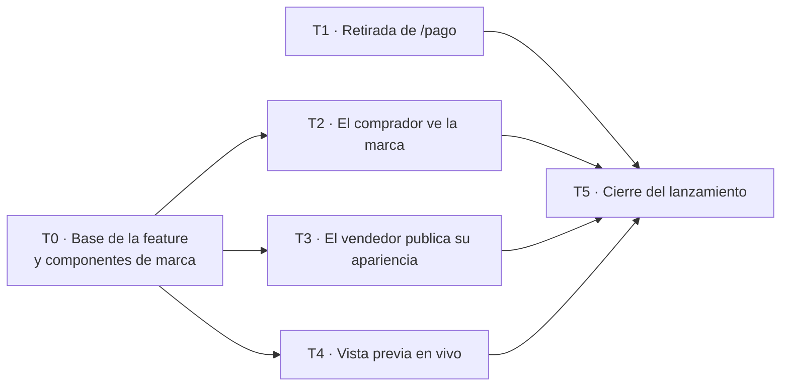

# Apariencia del checkout · Tareas

Plan de trabajo del [diseño técnico](apariencia-del-checkout-implementacion.md), que define cada pieza citada aquí (las referencias numéricas, como 10.3 o 12.1, son secciones de ese documento). La especificación de producto está en [apariencia-del-checkout.md](apariencia-del-checkout.md).

Son seis tareas. Cada una entrega un flujo completo que se puede probar de punta a punta, no una capa suelta. T0 construye la base (persistencia, dominio y catálogo de colores) y desbloquea al resto; T1 no depende de nada; T2, T3 y T4 avanzan en paralelo; T5 cierra el lanzamiento.

| Tarea | Flujo que se puede probar | Depende de | En paralelo con |
| --- | --- | --- | --- |
| T0 | Storybook muestra el checkout con cada color del catálogo, fondo y logo | — | T1 |
| T1 | Un enlace antiguo `/pago` lleva al checkout del pedido | — | Todas |
| T2 | Un comprador abre su enlace y ve la marca del negocio | T0 | T1, T3, T4 |
| T3 | Un vendedor sube logo, elige un color en el diálogo y el fondo, guarda y lo ve publicado | T0 | T1, T2, T4 |
| T4 | Un vendedor ve el borrador en la vista previa antes de guardar | T0 | T1, T2, T3 |
| T5 | Recorrido completo del lanzamiento, revisado frente al mock | T1–T4 | — |

**Archivos compartidos.** Para evitar conflictos, cada tarea toca solo su parte de estos archivos:

| Archivo | T1 | T2 | T3 | T4 |
| --- | --- | --- | --- | --- |
| `app/routes.ts` | — | — | ruta `settings/checkout-appearance` | ruta `settings/checkout-appearance/preview` |
| `private-layout.tsx` | — | — | entrada de navegación | extracción del middleware a `private-access.ts` |
| `app/locales.ts` | texto de `orders.buyerPaymentLink` | — | textos del editor | textos de la barra de vista previa |
| `logger.ts` y `newrelic.cjs` | regla de `/pago/:orderId` | — | regla de `/settings/checkout-appearance` | regla de `.../preview` |

T3 y T4 se encuentran en un solo punto: el editor renderiza `<CheckoutPreviewFrame>`, que construye T4. T5 reemplazó el espacio reservado de T3 por ese componente.

## T0 · Base de la feature y componentes de marca

**Flujo:** en Storybook, el checkout se ve con cada color del catálogo combinado con cada fondo, logo y modo, y la fachada `checkoutAppearance` está completa para que las rutas la consuman.

**Alcance**

- Migración con la tabla `CompanyCheckoutAppearance`, los enums `CheckoutBrandColor` y `CheckoutBackground` y RLS (4).
- Dominio: modelo, `parseCheckoutAppearance` y tipos marcados `CompanyId`, `ImageId`, `HexColor` (5.1); catálogo `checkoutBrandColorCatalog` con los tokens completos de los nueve colores y `checkoutPalette` (5.2).
- Casos de uso, repositorio, `composition.ts` con `checkoutAppearance.getPreview` (nombre, apariencia, URL del logo y medios de cobro), esquemas de presentación (6 y 7) e `invalidFields` en `invalid_stored_checkout_appearance`.
- `CheckoutTheme` y `CheckoutBrandHeader` en `presentation/` (10.1 y 10.2).
- Historias de Storybook: los nueve colores × tres fondos × dos modos, y logos cuadrados, horizontales, transparentes y rotos.
- Tests: `checkout-colors`, `checkout-appearance` (dominio y aplicación), `checkout-theme` y la integración del repositorio (14).

**Fuera de alcance**

- Cambiar cualquier ruta, incluido `checkout.tsx`.
- Fixtures y protocolo de la vista previa (T4).

**Criterios de aceptación**

- [ ] En la feature no quedan identificadores ni colores tipados como `string` en dominio, aplicación y fachada.
- [ ] Los cuatro tonos base de cada color coinciden con la tabla de la definición de producto, y los tests del catálogo verifican todos los contrastes de 5.2.
- [ ] Un color fuera del catálogo se rechaza en el dominio y en la base.
- [ ] `getPreview` devuelve los medios de cobro reales, o `null` si el negocio no tiene ninguno.
- [ ] Una fila corrupta registra `invalid_stored_checkout_appearance` con los campos inválidos.
- [ ] En Storybook, cada historia cumple los contrastes del panel de accesibilidad en ambos modos.
- [ ] Un logo roto deja solo el nombre, sin hueco ni icono de imagen rota.
- [ ] Pasan los tests unitarios e integración de la feature, `typecheck` y `lint`.

## T1 · Retirada de `/pago/:orderId`

**Flujo:** el vendedor comparte el enlace desde el detalle del pedido y el comprador llega directo al checkout. Un enlace `/pago` compartido antes redirige al checkout del mismo pedido.

**Alcance**

- Loader de `buyer-payment.tsx`: redirección 301 para pedidos con checkout habilitado; los pedidos sin checkout conservan la página de pago (`ErrorBoundary` y cabeceras incluidos) (10.4).
- `order-detail.tsx` enlaza a `/checkout/:companyId/:orderId` si el checkout está habilitado y a `/pago/:orderId` si no, y se ajusta el texto `orders.buyerPaymentLink`.
- Normalización de `/pago/:orderId` en `logger.ts` y `newrelic.cjs`, con `outcome` explícito.
- Tests `buyer-payment.test.ts` y reescritura de `tests/e2e/buyer-payment.spec.ts`.

**Fuera de alcance**

- Apariencia de marca en el checkout (T2).
- Cambios en `getBuyerPaymentView`, la API de comprobantes o `BuyerPaymentContent`, que el checkout sigue usando.

**Criterios de aceptación**

- [ ] `GET /pago/:orderId` de un pedido con checkout habilitado responde 301 a `/checkout/:companyId/:orderId`.
- [ ] Un pedido inexistente o un ID inválido muestran el error genérico (404), y una falla de base, 503.
- [ ] En el checkout de destino, el comprador puede ver los medios de pago y subir el comprobante como antes.
- [ ] El detalle del pedido ya no genera enlaces `/pago` para pedidos con checkout habilitado.
- [ ] Un pedido sin checkout conserva la página de pago.
- [ ] Los logs registran la ruta como `/pago/:orderId`, no como `/{*splat}`.

## T2 · El comprador ve la marca

**Flujo:** con una apariencia guardada (por SQL o con el helper de los tests), el comprador abre su enlace y ve logo, color y fondo en revisión, confirmación y pago, en claro y oscuro. Una empresa sin apariencia ve el checkout exactamente como hoy.

**Alcance**

- Loader de `checkout.tsx`: `getPublic` en paralelo con entrega y pago, validación con `publicCheckoutAppearanceSchema` y la etiqueta `checkoutAppearance` (10.3).
- La página se envuelve en `CheckoutTheme` y usa `CheckoutBrandHeader`; el `ErrorBoundary` queda sin marca.
- Helper de test para guardar una apariencia de una empresa.
- Tests nuevos de `checkout.test.ts` y el bloque `buyer checkout with appearance` del E2E.

**Fuera de alcance**

- El editor (T3); la apariencia se crea solo desde tests o SQL.
- Cambios en `publicCheckoutSchema` o en las respuestas de la action de confirmación.

**Criterios de aceptación**

- [ ] Logo, color y fondo se ven en los estados pendiente, confirmado y pago, y en ambos modos.
- [ ] El HTML del servidor ya trae el `<style>` de la marca: no hay destello de la apariencia de Yoyos al cargar.
- [ ] Un enlace inválido muestra el error genérico sin marca y no consulta la apariencia.
- [ ] Si falla la lectura de la apariencia, el pedido se carga con la apariencia de Yoyos y se puede confirmar y pagar.
- [ ] La respuesta solo expone `logoUrl`, `brandColor` y `background`.
- [ ] La solicitud queda etiquetada con `default`, `custom` o `fallback`.
- [ ] Los flujos de cotización de envío y pago siguen pasando sus E2E.

## T3 · El vendedor publica su apariencia

**Flujo:** desde «Apariencia del checkout» en la navegación, el vendedor sube un logo, elige un color en el diálogo y el fondo, guarda y, al recargar un enlace de checkout ya compartido, ve la apariencia nueva. También puede descartar, restablecer y salir con cambios sin perderlos por accidente.

**Alcance**

- Ruta `settings/checkout-appearance` en las dos ramas del layout privado, con su entrada de navegación y sus textos ([10.5](apariencia-del-checkout-implementacion.md#105-editor-routescheckout-appearance-settingstsx)).
- Loader y action, con normalización de ruta y `outcome` explícito.
- Controles de logo (subida con `POST /api/images`), fila de color con `<BrandColorDialog>` y fondo segmentado Blanco / Neutro / De marca.
- Guardar, descartar, restablecer, `useBlocker` y estados de error con reintento.
- Diseño de una columna con pestañas en celular.
- Tests `checkout-appearance-settings.test.ts` y los casos del E2E del editor que no dependen de la vista previa.

**Fuera de alcance**

- El contenido de la vista previa (T4): se deja un espacio reservado con las dimensiones finales.
- Limpiar logos subidos y descartados.

**Criterios de aceptación**

- [ ] Lo guardado aparece al recargar el checkout de un pedido existente, con el resultado de T2 si ya está integrado, o en la fila de la base si no.
- [ ] El `companyId` sale siempre de la sesión, aunque el cuerpo traiga otro.
- [ ] El color solo se puede elegir entre los nueve del catálogo; no hay campo HEX ni selector libre.
- [ ] «Usar <color>» cambia el borrador; «Cancelar», cerrar o Escape conservan el color anterior.
- [ ] La fila y el diálogo muestran una sola muestra: la del modo activo en la vista previa.
- [ ] Una subida o un guardado fallidos conservan el borrador y lo publicado.
- [ ] «Restablecer» no publica nada hasta guardar.
- [ ] Salir con cambios ofrece «Seguir editando» y «Descartar y salir».
- [ ] El diálogo se opera con teclado: foco en la opción actual, flechas, Enter y devolución del foco a la fila.
- [ ] Todo el editor se puede completar con teclado en un ancho de 390 px.
- [ ] Cada guardado registra `checkout_appearance_saved` con los campos de 12.1.

## T4 · Vista previa en vivo

**Flujo:** el vendedor cambia color, fondo o logo y la vista previa los aplica al instante; puede alternar celular y escritorio, claro y oscuro, y revisión y pago, sin afectar el checkout público ni crear pedidos.

**Alcance**

- Extracción del middleware privado a `app/private-access.ts` y su uso desde `private-layout.tsx`, sin cambiar comportamiento.
- Ruta `settings/checkout-appearance/preview` fuera del layout, con `getPreview`, `preview-fixtures.ts` y normalización de ruta (10.6).
- `preview-protocol.ts` (`ready` y `update`, validados por origen y esquema).
- `<CheckoutPreviewFrame>`: iframe con `sandbox`, escalado de 390 y 1280 px, y controles de dispositivo, modo y estado. Recibe la apariencia del borrador como prop.
- Tests `preview-protocol.test.ts` y los casos de vista previa del E2E.

**Fuera de alcance**

- El estado del borrador y los controles del editor (T3).
- Permitir confirmar, pagar o subir comprobantes desde la vista previa.

**Criterios de aceptación**

- [ ] Abierta directamente y autenticada, la ruta de vista previa muestra el checkout con datos de ejemplo y la barra «Vista previa · Datos de ejemplo»; sin sesión, redirige al login.
- [ ] El estado «Pago» muestra los medios de cobro reales del negocio, o los de ejemplo rotulados si no tiene.
- [ ] Los mensajes de otro origen o con otra forma se ignoran.
- [ ] Ningún botón de la vista previa confirma, paga ni envía formularios.
- [ ] En el ancho de 390 px se activan los breakpoints de celular del checkout real.
- [ ] El cambio a modo oscuro no altera la preferencia guardada del vendedor.
- [ ] Las rutas privadas existentes siguen pasando sus tests tras extraer el middleware.

## T5 · Cierre del lanzamiento

**Flujo:** un vendedor configura su apariencia, la revisa en la vista previa, la publica y un comprador la ve en su enlace, incluido uno `/pago` antiguo.

**Alcance**

- Integrar `<CheckoutPreviewFrame>` en el editor y completar el E2E `checkout appearance editor`.
- Revisión visual con Impeccable frente al mock aprobado `a4` (`.impeccable/mocks/checkout-editable/`) y creación del registro de superficie.
- Verificar en un entorno de staging los logs y las transacciones de New Relic de las cuatro rutas.
- Actualizar la [definición de producto](apariencia-del-checkout.md) si algo cambió durante la construcción.

**Fuera de alcance**

- Funcionalidades nuevas o cambios de alcance de producto.

**Criterios de aceptación**

- [ ] Todo el capítulo 14 pasa: unitarios, integración y E2E.
- [ ] El editor coincide con el mock aprobado, o las diferencias están documentadas en el registro de superficie.
- [ ] Ningún log de las rutas nuevas aparece como `/{*splat}` ni con `outcome: invalid_input` en una respuesta exitosa.
  - **Pendiente en staging** (responsable: el equipo que despliega; ningún agente tiene acceso a staging ni a New Relic). Lo que cubren los tests locales:
    - `logger.test.ts` normaliza las cuatro rutas y no infiere `invalid_input` en un 200.
    - El test «names the four routes…» comprueba los patrones de `newrelic.cjs` con `RegExp`.
    - Ninguno prueba que el agente aplique `rules.name` a las transacciones reales de React Router.

    En New Relic, el nombre esperado es `WebTransaction/NormalizedUri/<name>` o la forma equivalente de la cuenta; importa el sufijo `<name>` y que **no** aparezca `/{*splat}`. En los logs se mira el evento `http_request_completed`.

    | Ruta (acción en staging) | Transacción NR esperada | Log `http_request_completed` esperado |
    | --- | --- | --- |
    | `GET /checkout/:companyId/:orderId` (abrir un pedido con checkout) y `POST` (confirmar) | `checkout` | `route: "/checkout/:companyId/:orderId"`. En `GET`: `operation: "get_checkout"`, `outcome` = estado del pedido (`pending`, `confirmed`…) y `checkoutAppearance` = `custom`, `default` o `fallback`. En `POST`: `operation: "confirm_checkout"`, `outcome: "confirmed"` o `"already_confirmed"`. Nunca `invalid_input` con `statusCode` 200/3xx. Sin `orderId` ni UUID en claro. |
    | `GET /pago/:orderId` de un pedido con checkout y de uno sin checkout | `pago` | `route: "/pago/:orderId"`, `operation: "redirect_buyer_payment"`. Con checkout: `outcome: "redirected"` y `statusCode` 301. Sin checkout: `outcome: "rendered"` y 200. |
    | `GET /es-PE/settings/checkout-appearance` (y su `.data`) y `POST` guardar | `settings/checkout-appearance` | `route: "/settings/checkout-appearance"`. Al cargar: `operation: "get_checkout_appearance"`, `outcome: "loaded"`. Al guardar: `operation: "save_checkout_appearance"`, `outcome: "saved"`. |
    | `GET /es-PE/settings/checkout-appearance/preview` (y su `.data`), es decir, el iframe del editor | `settings/checkout-appearance/preview` | `route: "/settings/checkout-appearance/preview"`, `operation: "get_checkout_preview"`, `outcome: "rendered"`. No debe agruparse bajo `settings/checkout-appearance`. |

    Se marca cuando el equipo que despliega adjunte, por ruta, el nombre de transacción visto en New Relic y una línea de log con `route`, `operation` y `outcome`. Si alguna ruta aparece como `/{*splat}`, se abre una tarea de corrección; T5 no la arregla.
- [ ] El recorrido del flujo se completa en celular y escritorio, en claro y oscuro.
