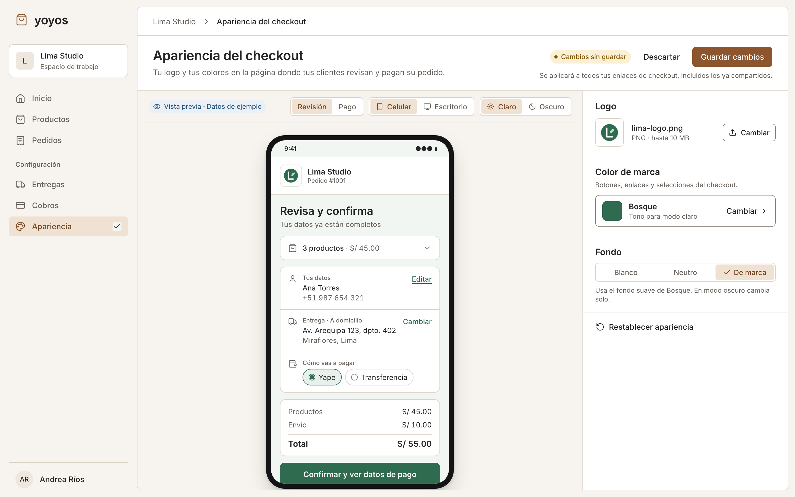
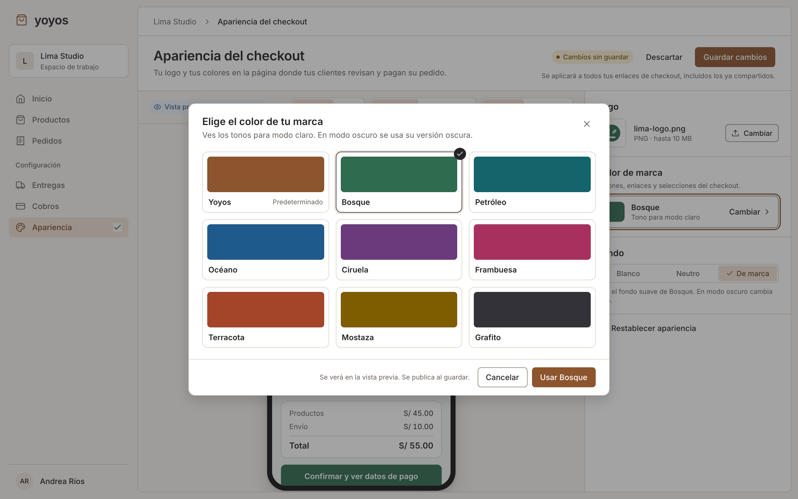

# Apariencia del checkout · Definición de producto

Fecha: 8 de octubre de 2026; actualizado el 10 de octubre de 2026 con colores predefinidos. Estado: especificación para implementación; funcionalidad pendiente de construir.

El usuario confirmó avanzar con una personalización limitada a la identidad de marca. Este documento concreta ese alcance y las reglas de producto de la primera versión. Complementa [Checkout del pedido por link](checkout-por-link.md), cuyas reglas comerciales y de acceso siguen vigentes.

## Objetivo

Permitir que cada negocio adapte el checkout a su marca mediante su logo y sus colores, sin conocimientos de diseño ni asistencia técnica.

El comprador que llega desde redes sociales o WhatsApp debe reconocer al negocio durante la revisión del pedido, la confirmación, la espera de cotización y el pago. El vendedor debe poder configurar esa identidad una vez y revisar el resultado antes de aplicarlo.

La hipótesis de producto es que una identidad reconocible reduce dudas al continuar la compra. No se asume una mejora de conversión hasta medirla.

## Usuarios y superficies

| Usuario | Necesidad | Superficie |
| --- | --- | --- |
| Vendedor con acceso a la configuración de su empresa | Configurar y revisar la apariencia | Configuración → Apariencia del checkout |
| Comprador | Reconocer la tienda y completar su pedido | Checkout público y página pública de pago |

La primera versión incluye un editor web adaptable a celular y escritorio. El checkout sigue funcionando en el navegador sin cuenta ni instalación. Un editor nativo dentro de la app móvil queda fuera de esta entrega; esta delimitación es una decisión de alcance de la especificación, no una limitación indicada originalmente por el usuario.

La apariencia pertenece a la empresa, no al vendedor ni al pedido. Todos los usuarios que actualmente pueden administrar sus ajustes de cobro podrán administrar también su apariencia. No se introduce un sistema nuevo de roles.

## Alcance de la primera versión

| Elemento | Control disponible | Comportamiento |
| --- | --- | --- |
| Logo | Subir, reemplazar y quitar | Se muestra en la cabecera, junto al nombre del negocio, en una ubicación fija. |
| Color de marca | Elegir uno de los colores predefinidos de Yoyos en un diálogo | Define botones principales, enlaces y selecciones. Cada color trae definidos sus tonos para modo claro y oscuro; no se ingresa un valor HEX. |
| Fondo | Blanco, Neutro o De marca | Son opciones controladas; De marca usa el fondo suave que acompaña al color elegido. |
| Vista previa | Celular/escritorio y claro/oscuro | Muestra los cambios sin publicarlos ni generar operaciones comerciales. |
| Publicación | Guardar cambios | Aplica el conjunto completo de cambios a la empresa. |
| Restauración | Restablecer apariencia | Prepara la apariencia original de Yoyos; requiere guardar para publicarla. |

Se mantienen fijos los colores disponibles, la estructura, tipografía, tamaños, posición de elementos, textos, campos, obligatoriedad, validaciones y orden del formulario. Tampoco se permiten CSS, HTML, scripts, bloques arrastrables, fondos con imágenes, dominios personalizados ni configuraciones por pedido, ni colores libres (HEX, selector de espectro o cuentagotas).

El comprador conserva la capacidad actual de completar o corregir sus datos antes de confirmar. La restricción sobre los inputs se refiere a que el vendedor no puede diseñar ni configurar el formulario.

## Flujo del vendedor

1. Entra en **Configuración → Apariencia del checkout**.
2. Ve la configuración publicada y una vista previa con datos ficticios claramente identificados.
3. Sube un logo, abre **Color de marca** para elegir un color en el diálogo y selecciona el fondo. Cada cambio actualiza la vista previa sin afectar enlaces públicos.
4. Revisa el resultado. La vista previa inicia en celular y permite alternar escritorio y modo claro/oscuro.
5. Pulsa **Guardar cambios**. La pantalla informa: «Se aplicará a todos tus enlaces de checkout, incluidos los ya compartidos».
6. Al completarse el guardado, ve «Apariencia actualizada». La configuración publicada pasa a ser el nuevo punto de partida del editor.

En escritorio, los controles y la vista previa aparecen uno junto a otro. En celular, se presentan en una columna con acceso claro a **Ver vista previa** y **Volver a editar**, conservando los cambios al alternar.

### Edición y publicación

- Cambiar un control, subir una imagen o restablecer no publica nada por sí solo.
- **Guardar cambios** solo está disponible cuando hay modificaciones válidas y no hay una subida o guardado en curso.
- **Descartar cambios** recupera la última configuración publicada.
- Al salir del editor con cambios sin guardar, se ofrece continuar editando o descartarlos.
- El borrador vive durante la sesión de edición; esta versión no incluye borradores persistentes ni historial de versiones.
- Un error de subida o guardado conserva los cambios locales y muestra una acción para reintentar. La apariencia pública anterior se mantiene completa.
- El guardado publica logo, color y fondo como una unidad; nunca una mezcla parcial.
- Si dos vendedores editan a la vez, la última publicación completada prevalece. No se incluye edición colaborativa.

## Reglas del logo

- Formatos admitidos: PNG, JPG y WEBP, con el mismo límite que las demás imágenes de Yoyos (10 MB). El mensaje de ayuda recomienda PNG transparente.
- Se comprueba que el archivo sea una imagen válida tanto al seleccionarlo como al recibirlo en el servidor. SVG queda fuera de esta versión.
- Se conserva la proporción y se muestra la imagen completa. No hay recorte, deformación, posicionamiento libre ni editor de imagen.
- La cabecera reserva un espacio acotado que admite logos cuadrados y horizontales sin desplazar excesivamente el contenido del pedido.
- Se mantiene una superficie clara y neutra detrás del logo en ambos modos para dar estabilidad a la imagen. No se recolorea ni invierte el archivo.
- El nombre actual de la empresa permanece visible; editar ese nombre no forma parte de este editor.
- Si no hay logo o falla su carga, el nombre identifica al negocio y no aparece un icono de imagen rota.
- Reemplazar o quitar el logo solo afecta a la publicación al guardar. Una subida fallida no elimina el logo publicado.
- La imagen elegida debe pertenecer a la misma empresa. Los logos publicados son visibles para los compradores y el editor debe indicarlo.

## Reglas de color y accesibilidad

El vendedor elige un color de marca de una lista cerrada que define Yoyos. Cada color ya viene diseñado para ser legible en modo claro y oscuro, así que el sistema no calcula ni corrige tonos a partir de un valor del vendedor.

### Colores disponibles

Cada color predefinido es una unidad con cuatro tonos fijos:

| Color | Tono claro | Fondo de marca claro | Tono oscuro | Fondo de marca oscuro |
| --- | --- | --- | --- | --- |
| Yoyos (predeterminado) | `#8C552D` | `#F7EFE6` | `#D5A16C` | `#1F1B19` |
| Bosque | `#2F6B4F` | `#F1F6F2` | `#8FCBA8` | `#181E1B` |
| Petróleo | `#13646B` | `#EEF6F6` | `#84CBD0` | `#161E1F` |
| Océano | `#1F5A8C` | `#EFF4FA` | `#8EBDE6` | `#171C22` |
| Ciruela | `#6B3A7D` | `#F6F1F8` | `#C9A2D8` | `#1E1921` |
| Frambuesa | `#A8305F` | `#FBF0F4` | `#EE9BBB` | `#221A1D` |
| Terracota | `#A4452A` | `#FBF2EE` | `#EDA38A` | `#221B19` |
| Mostaza | `#7E5C00` | `#FAF5E6` | `#E3C063` | `#201E17` |
| Grafito | `#333238` | `#F4F4F5` | `#C9C7CF` | `#1C1C1E` |

- Los valores HEX de la tabla son internos de Yoyos: el vendedor ve solo el nombre y la muestra del color, nunca un código ni un campo editable.
- La configuración guarda el identificador del color elegido, no sus tonos. Si Yoyos ajusta los tonos de un color, todas las empresas que lo usan reciben el ajuste al recargar el checkout.
- Un identificador desconocido o retirado se trata como configuración inválida y el checkout usa el color predeterminado de Yoyos.
- El texto sobre botones es blanco en modo claro y oscuro (cercano a `#1C1B1D`) en modo oscuro. Los tonos de foco, hover y pulsación forman parte de la definición de cada color; no se generan a partir de otro valor.
- Agregar, modificar o retirar colores es una decisión de producto de Yoyos y se publica como cambio de código, no desde el editor.

### Uso y contraste

- El color de marca se utiliza en las acciones de confirmar y enviar comprobante, en enlaces y en selecciones relevantes.
- Texto normal: contraste mínimo de 4,5:1; texto grande: 3:1. Controles e indicadores visuales necesarios para operar deben alcanzar 3:1 respecto de los colores adyacentes.
- Todos los colores de la tabla cumplen esos mínimos. Medición del 10 de octubre de 2026: el tono claro alcanza al menos 6,06:1 frente a texto blanco y 5,34:1 frente a su fondo de marca; el tono oscuro alcanza al menos 7,44:1 frente a su fondo oscuro y frente al texto oscuro del botón. Cualquier color nuevo debe pasar la misma verificación antes de agregarse.
- La selección, los errores y los estados no se comunican únicamente mediante color. Se conservan texto, iconos y foco de teclado visibles.
- Errores, advertencias, éxito y estados de pago mantienen sus significados y colores semánticos. El color comercial no redefine «pagado» o «cancelado».
- Las tarjetas y los campos conservan superficies controladas por el sistema para garantizar lectura y jerarquía.
- Los QR, comprobantes e imágenes de instrucciones de pago se muestran con sus colores originales.

### Fondos y modo oscuro

En modo claro, **Blanco** usa una base blanca, **Neutro** conserva la base neutra de Yoyos y **De marca** utiliza el fondo de marca claro del color elegido.

El modo oscuro continúa respetando la preferencia actual del producto/navegador y usa equivalentes oscuros accesibles: neutros para Blanco y Neutro, y el fondo de marca oscuro del color elegido para De marca. No se interpreta «Blanco» como una orden de desactivar el modo oscuro.

El vendedor elige un solo color; no configura por separado los tonos claro y oscuro ni el fondo de marca. La vista previa permite revisar las variantes que realmente verá el comprador. La personalización solo afecta a las superficies públicas del negocio; no cambia el tema del panel de gestión.

### Selector de color

- En el inspector, **Color de marca** muestra una fila con una sola muestra, el nombre del color y **Cambiar**. La muestra corresponde al modo activo en la vista previa: el tono claro en modo claro y el tono oscuro en modo oscuro, con el texto «Tono para modo claro» o «Tono para modo oscuro».
- Al pulsar la fila se abre el diálogo **Elige el color de tu marca**, con los nueve colores en una cuadrícula. Cada opción muestra una sola muestra del modo activo y su nombre; Yoyos lleva la etiqueta «Predeterminado».
- La opción actual se marca con borde y un icono de verificación, no solo con color. El diálogo indica qué modo se está viendo y que el otro modo usa la versión correspondiente.
- **Usar <color>** aplica la elección al borrador y a la vista previa; **Cancelar**, cerrar o Escape descartan la elección dentro del diálogo. El pie recuerda: «Se verá en la vista previa. Se publica al guardar».
- El diálogo se opera con teclado: foco inicial en la opción actual, flechas para moverse por la cuadrícula, Enter para elegir y devolución del foco a la fila al cerrar.
- Cuando el fondo es De marca, el texto de ayuda del fondo nombra el color elegido, por ejemplo «Usa el fondo suave de Bosque. En modo oscuro cambia solo».

## Experiencia del comprador

La identidad se aplica a `/checkout/:companyId/:orderId`, siempre después de resolver y autorizar el acceso al pedido. Los enlaces de pago `/pago/:orderId` de pedidos con checkout habilitado redirigen al checkout del pedido, que ya muestra el pago tras confirmar. Los pedidos sin checkout (históricos, POS o manuales) conservan la página de pago.

| Estado | Resultado esperado |
| --- | --- |
| Pendiente de confirmación | Logo, nombre y apariencia en revisión, formulario y acción principal. |
| Confirmado, esperando cotización | Misma identidad; se conservan espera, actualización de estado y bloqueo del pago. |
| Listo para pagar | Misma identidad en selección de medio, instrucciones y carga del comprobante. |
| Comprobante enviado | Misma identidad y mensaje de pago pendiente de revisión. |
| Pagado | Misma identidad con el estado real del pedido. |
| Cancelado | Misma identidad cuando el acceso es válido; confirmación bloqueada. |
| Enlace inválido o no disponible | Error genérico de Yoyos, sin revelar la identidad de una empresa que no se haya podido autorizar. |

Los enlaces ya compartidos conservan su URL. Al abrir o recargar una página, el comprador recibe la última apariencia publicada. Una página que ya está abierta no tiene que cambiar en vivo ni interrumpir la edición del comprador.

Los pedidos históricos usan también la apariencia vigente: esta versión no conserva una copia de la marca por pedido. Los importes, datos del comprador y estados comerciales no se alteran al publicar una apariencia.

## Vista previa

- Usa datos de ejemplo y se identifica como **Vista previa · Datos de ejemplo**. En el estado de pago muestra los medios de pago reales del negocio, o ejemplos si no tiene ninguno; pedido, comprador e importes son siempre ficticios.
- Reproduce el mismo resultado visual que la página pública, incluidos logo, variantes de color, fondos y estados de interacción.
- Permite alternar al menos **Revisión del pedido** y **Pago** para comprobar las dos superficies principales del recorrido.
- No utiliza información real de compradores ni enlaces públicos de pedidos como material de prueba.
- Los botones de confirmación, pago y carga de comprobantes son demostrativos: no envían solicitudes, crean pedidos ni registran pagos.
- Un logo nuevo puede previsualizarse antes del guardado, pero no se considera publicado por haber sido subido.

## Valores iniciales y recuperación

Las empresas sin configuración conservan la apariencia actual de Yoyos y su nombre en la cabecera. No necesitan completar un nuevo paso para seguir compartiendo pedidos.

**Restablecer apariencia** deja sin logo personalizado y recupera en el borrador el color Yoyos y el fondo original. Se puede deshacer descartando; solo se aplica a compradores después de guardar.

Una configuración de apariencia ausente o inválida no debe impedir confirmar ni pagar un pedido válido: se utiliza la apariencia predeterminada. Esto no sustituye ni omite las validaciones de acceso, importes, entrega o pago.

## Límites de seguridad y comportamiento comercial

- Solo usuarios autenticados con acceso a la configuración de la empresa pueden modificar su apariencia. Conocer un enlace público no concede ese permiso.
- La empresa se determina desde el contexto autorizado; un usuario no puede modificar otra empresa ni asociar sus imágenes.
- La respuesta pública expone únicamente los datos visuales necesarios, sin configuración privada ni información de administración.
- Se conservan las reglas de privacidad y caché de las páginas públicas existentes.
- Confirmar sigue expresando intención de compra; no significa pago recibido. La revisión del vendedor sigue siendo necesaria para confirmar el cobro.
- No cambian los campos, validaciones, cálculo de totales, cotización de entrega, requisitos del comprobante ni disponibilidad de medios de pago.

## Criterios de aceptación

1. Una empresa sin personalización puede usar todos sus enlaces con la apariencia predeterminada.
2. Un vendedor autorizado puede subir, reemplazar y quitar un logo admitido; un archivo inválido o demasiado grande produce un error comprensible y conserva la publicación anterior.
3. Un logo cuadrado, horizontal o transparente se muestra completo en celular y escritorio; si falla, el nombre del negocio sigue visible.
4. Color y fondo se reflejan en la vista previa antes de guardar, sin modificar páginas públicas.
5. Solo se puede elegir uno de los colores predefinidos, sin ingresar valores libres; cada color se muestra con sus tonos y fondos definidos, con contraste suficiente y foco visible en ambos modos. Un identificador de color desconocido muestra el color predeterminado sin bloquear el pedido.
6. Guardar publica toda la configuración y un enlace previamente compartido la muestra al recargarse, manteniendo su URL.
7. Una subida o publicación fallida permite reintentar sin perder la edición ni alterar parcialmente la apariencia pública.
8. Descartar recupera lo publicado; restablecer requiere guardar; salir con cambios pendientes ofrece conservar la edición o descartarla.
9. La identidad es consistente en revisión, espera de cotización, pago, comprobante pendiente, pagado y cancelado; un enlace `/pago/:orderId` ya compartido lleva al checkout del pedido.
10. La vista previa usa datos ficticios y ninguna interacción ejecuta acciones comerciales reales.
11. La configuración de una empresa no modifica la de otra ni la apariencia del panel privado; un comprador no puede editarla.
12. Los formularios y las reglas comerciales existentes conservan su funcionamiento, incluido el bloqueo del pago mientras falta cotizar la entrega.
13. Un enlace no autorizado muestra el error genérico; un fallo exclusivo del logo o de la apariencia no bloquea un pedido autorizado.
14. La pantalla de configuración y la experiencia pública pueden operarse con teclado y en una pantalla de celular sin desplazamiento horizontal causado por los controles o el logo.

## Diseño web elegido · Vista previa protagonista con colores predefinidos

El usuario seleccionó **Vista previa protagonista** entre tres propuestas de Impeccable y luego aprobó su versión con colores predefinidos (a4, 10 de octubre de 2026). Reemplaza al mock anterior con selector HEX. Es la referencia visual aprobada para la pantalla de configuración web; la funcionalidad todavía no está implementada.

- Editor con el diálogo cerrado: [claro](../.impeccable/mocks/checkout-editable/a4-closed-light.png) y [oscuro](../.impeccable/mocks/checkout-editable/a4-closed-dark.png).
- Diálogo de colores: [claro](../.impeccable/mocks/checkout-editable/a4-dialog-light.png) y [oscuro](../.impeccable/mocks/checkout-editable/a4-dialog-dark.png).
- [Registro de aprobación](../.impeccable/mocks/checkout-editable/a4.json) y [fuentes HTML de los mocks](../.impeccable/mocks/checkout-editable/src/), capturados a 1440 × 900.

### Composición que debe conservarse

1. **Navegación existente de Yoyos a la izquierda**, con Apariencia seleccionada dentro de Configuración y sin modificar la identidad del panel de gestión.
2. **Cabecera con título y publicación**: título y descripción a la izquierda; estado de cambios, Descartar y Guardar cambios a la derecha. El alcance de la publicación se comunica junto a las acciones.
3. **Vista previa como región principal**, ocupando aproximadamente dos tercios del espacio de edición. El comprador ve su checkout dentro de un lienzo neutro, separado de los controles administrativos.
4. **Barra sobre la vista previa** con identificación de datos de ejemplo y controles de revisión/pago, dispositivo y modo claro/oscuro.
5. **Inspector fijo a la derecha**, de aproximadamente un tercio del área de edición, con Logo → Color de marca → Fondo → Restablecer apariencia. Secciones separadas por líneas discretas, sin convertirlas en un asistente de pasos.
6. **Color de marca como fila que abre un diálogo**: una sola muestra del modo activo, nombre del color y Cambiar. No se muestran juntos los tonos claro, oscuro y de fondo.
7. **Fondo como control segmentado** Blanco / Neutro / De marca, con una línea de ayuda debajo.
8. **Diálogo de colores** con cuadrícula de 3 × 3, una muestra por opción, selección con borde y verificación, y pie con nota de publicación, Cancelar y Usar <color>.
9. **Identidades separadas**: caramelo para acciones y selección del editor; color del comercio en la vista previa y las muestras de color. Bosque, el verde de Lima Studio, es un ejemplo, no el valor predeterminado del producto.

### Directrices de implementación de Impeccable

- Seguir el flujo **comp-led**: el mock elegido gobierna composición, proporciones, jerarquía, densidad y carácter de los componentes. No sustituirlo por otra distribución conservando solo los colores.
- Mantener el sistema visual existente, **Caramelo sobrio**, la tipografía Inter, superficies planas y bordes discretos. Esta pantalla amplía Yoyos; no establece una identidad global nueva.
- Reproducir primero la vista de escritorio a la resolución del mock y compararla visualmente con una captura de la implementación. Después completar interacciones y adaptación a otros anchos.
- Construir textos, controles y vista previa con componentes semánticos. La imagen aprobada es una referencia, nunca un fondo que sustituya la interfaz funcional.
- La vista previa debe reutilizar el resultado visual del checkout real. La imagen no autoriza introducir campos, afirmaciones de seguridad, cambios comerciales ni un checkout diferente al definido en este documento.
- Tienda, monograma, comprador, dirección e importes del mock son datos ficticios. Los colores del producto son los de la tabla de colores disponibles, no los que se midan en la imagen.
- El marco móvil representa el dispositivo previsualizado; no implica una app nativa ni nuevos controles del comprador. La adaptación del editor a celular conserva la jerarquía y los cambios pendientes, según el flujo definido arriba.
- Verificar celular y escritorio, claro y oscuro, teclado, errores y guardado. Comparar tanto la vista previa como la página pública para evitar divergencias.
- Al terminar la implementación, realizar la revisión visual de Impeccable, resolver sus hallazgos materiales y actualizar el registro de superficie con evidencia del resultado construido. La aprobación de este mock no equivale a una implementación validada.

## Validación de producto

Antes del lanzamiento general, probar con 3–5 vendedores usando logos y colores reales. Observar si encuentran la configuración, completan la personalización sin ayuda y entienden cuándo se publica y a qué enlaces afecta.

Medir adopción entre negocios que usan checkout, finalización del flujo de configuración y frecuencia de errores de subida/guardado. Comparar el avance de apertura a confirmación y de pago habilitado a comprobante enviado, separando pedidos que esperan cotización para no atribuir esa espera al diseño.

Las métricas son una propuesta de evaluación, no funcionalidades adicionales del editor ni una promesa de mejora comercial. Los objetivos numéricos se fijarán con una línea base; no condicionan la definición funcional de esta versión.

## Referencias y puntos de partida

- [Checkout por link de Yoyos](checkout-por-link.md): reglas del pedido, acceso público, entrega y pago.
- [Página actual de checkout](../apps/core/app/routes/checkout.tsx): superficie que recibe la identidad. El [pago independiente](../apps/core/app/routes/buyer-payment.tsx) se reemplaza por una redirección.
- [Ajustes de cobro](../apps/core/app/routes/payment-settings.tsx): patrón existente de configuración y carga de imágenes.
- [Stripe: apariencia de Checkout](https://docs.stripe.com/payments/checkout/customization/appearance?payment-ui=stripe-hosted): referencia de controles acotados de marca.
- [Shopify: estilo del checkout](https://help.shopify.com/en/manual/checkout-settings/customize-checkout-configurations/checkout-style): referencia de configuración visual.
- [W3C: contraste de texto](https://www.w3.org/WAI/WCAG22/Understanding/contrast-minimum.html) y [contraste no textual](https://www.w3.org/WAI/WCAG22/Understanding/non-text-contrast.html).

Este documento define comportamiento de producto y la dirección visual aprobada del editor web. El esquema de persistencia y los contratos de implementación se resolverán reutilizando la infraestructura existente, sin introducir un motor general de temas o un constructor de páginas.

