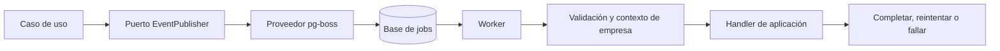

# Arquitectura del event bus y procesamiento de jobs

Estado: infraestructura implementada; aún no hay eventos de negocio registrados.

## 1. Decisión y alcance

Se mantiene la arquitectura conceptual de animo-sales: eventos tipados definidos
por feature, un puerto de publicación y suscripción, handlers registrados en el
arranque y un proveedor intercambiable.

El proveedor de producción es **pg-boss sobre PostgreSQL**. Ejecuta los
handlers como jobs durables en un proceso worker separado de Express. El
proveedor en memoria se usa para pruebas de aplicación.

La decisión de conservar esa arquitectura y usar pg-boss está implementada en
core. Los contratos y valores siguientes describen la infraestructura actual.

Esta implementación cubre la infraestructura del bus. Cada incorporación de un
evento o migración de un flujo de negocio se definirá por separado.

El patrón outbox no es una opción dentro de la API del event bus.

## 2. Herramienta

| Elemento | Elección |
| --- | --- |
| Motor de jobs | `pg-boss` |
| Versión fijada | `12.35.0` |
| Almacenamiento inicial | PostgreSQL existente, con esquema técnico `pgboss`; conexión del proveedor configurable |
| Ejecución | Worker Node.js 24, desplegado con el mismo código que core |
| Contratos | TypeScript y `Result` de `@shared/result` |
| Validación de JSON | Zod en los adaptadores |

pg-boss es MIT y permite usar la infraestructura PostgreSQL que ya opera Yoyos.
No exige comprar una licencia. El costo operativo incluye recursos de base de
datos y worker, tanto en despliegue propio como administrado.
[Fuente oficial](https://pgboss.io/).

Inicialmente se reutilizará la base actual. La conexión de jobs podrá apuntar
más adelante a otra base o instancia PostgreSQL. El mecanismo de aislamiento de
negocio se conserva y los tipos de pg-boss y Prisma permanecen en infraestructura.

## 3. Flujo y responsabilidades



- El caso de uso decide qué hecho ocurrió y cuándo publicarlo.
- El bus aporta tipado, metadatos y distribución a los handlers registrados.
- El proveedor persiste jobs y adapta sus resultados al motor de ejecución.
- El worker valida los datos, restaura el contexto de empresa y ejecuta handlers.
- El handler coordina su tarea mediante dependencias explícitas de aplicación.
- pg-boss administra estados, reintentos, expiración y recuperación de jobs.

Los invariantes que deben cumplirse para confirmar la operación permanecen en su
transacción. Por ejemplo, registrar una venta y descontar stock siguen siendo
una operación atómica; un job posterior no sustituye ese descuento.

## 4. Evento y job

Un evento describe un hecho: `order.completed`. Un job es la ejecución de uno de
sus handlers: `send-order-receipt` o `sync-order-with-provider`.

```text
order.completed, eventId = E
  ├── cola send-order-receipt      → job propio y política propia
  └── cola sync-order-with-provider → job propio y política propia
```

Habrá una cola por handler, compartida entre empresas. Cada publicación crea un
job por handler registrado para ese evento. Las réplicas de un worker compiten
por jobs de la misma cola; no representan nuevos suscriptores del evento.

Reintentar un handler no vuelve a ejecutar los que ya terminaron. `eventId` se
conserva en todas las ejecuciones y cada handler tiene un ID estable. No se
promete orden global entre eventos ni entre handlers.

## 5. Puerto y tipos de aplicación

Estos contratos son independientes del proveedor. No exponen `PgBoss`, `Job`,
clientes SQL ni transacciones Prisma.

```typescript
import type { Result } from "@shared/result";

// Registro extensible mediante declaration merging, igual que en animo-sales.
export interface AppEvents {}

export type EventName<Events extends object> = Extract<keyof Events, string>;

export type EventPayload<Events extends object, Name extends EventName<Events>> =
  Events[Name] & Readonly<{ companyId: string }>;

export type EventMetadata = Readonly<{
  eventId: string;
  occurredAt: string; // ISO 8601 UTC; se conserva al reintentar.
}>;

export type EventBusError = Readonly<{
  code: "INVALID_EVENT" | "EVENT_BUS_UNAVAILABLE" | "INVALID_SUBSCRIPTION";
  message: string;
}>;

export type EventHandlerError = Readonly<{
  code: string;
  message: string;
  retryable: boolean;
}>;

export type EventHandlerContext = Readonly<{
  signal: AbortSignal; // Señal nativa del job de pg-boss.
  attempt: number; // Primer intento = 1.
}>;

export type EventHandler<Events extends object, Name extends EventName<Events>> = (
  payload: EventPayload<Events, Name>,
  metadata: EventMetadata,
  context: EventHandlerContext,
) => Promise<Result<void, EventHandlerError>>;

export type HandlerPolicy = Readonly<{
  retries: number; // Reintentos adicionales al primer intento.
  retryDelaySeconds: number;
  exponentialBackoff: boolean;
  concurrency: number; // Por handler y proceso worker.
}>;

export type EventSubscription<Events extends object, Name extends EventName<Events>> =
  Readonly<{
    id: string; // ID estable del handler; único en el registro.
    name: Name;
    handler: EventHandler<Events, Name>;
    policy: HandlerPolicy;
    parsePayload: (
      input: unknown,
    ) => Result<EventPayload<Events, Name>, EventBusError>;
  }>;

export type Unsubscribe = () => Promise<Result<void, EventBusError>>;

export interface EventPublisher<Events extends object> {
  publish<Name extends EventName<Events>>(
    name: Name,
    payload: EventPayload<Events, Name>,
    metadata: EventMetadata,
  ): Promise<Result<void, EventBusError>>;
}

export interface EventSubscriber<Events extends object> {
  subscribe<Name extends EventName<Events>>(
    subscription: EventSubscription<Events, Name>,
  ): Promise<Result<Unsubscribe, EventBusError>>;
}

export interface EventBusProvider<Events extends object>
  extends EventPublisher<Events>, EventSubscriber<Events> {}
```

`EventPublisher` es la capacidad que recibe aplicación. `EventSubscriber` se usa
al componer y arrancar el worker. `EventBusProvider` reúne ambas capacidades en
el adaptador, sin obligar a que todos los procesos consuman jobs.

`parsePayload` es una función con un contrato neutral. La implementación usa
Zod en el adaptador; el puerto no depende de sus tipos.

Los payloads contienen datos serializables, preferentemente identificadores y
los valores necesarios para interpretar el hecho. No incluyen funciones,
repositorios, credenciales ni objetos de SDK. Si el handler consulta datos
actuales, se acepta que pueden haber cambiado desde que ocurrió el evento;
cuando necesita el estado original, el evento debe incluir ese snapshot mínimo.

### Envelope de persistencia

El proveedor guarda un envelope JSON validado en ambas direcciones:

```typescript
type StoredEvent = Readonly<{
  version: 1;
  name: string;
  payload: unknown;
  metadata: EventMetadata;
}>;
```

Es un contrato de infraestructura, separado de los tipos de negocio. El worker
valida el envelope y luego el payload con el parser de la suscripción. Un dato
inválido se registra como falla permanente; no llega al handler.

## 6. API de uso y compatibilidad con animo-sales

Se conservan los nombres `publishEvent`, `defineEventHandler`, `subscribeToEvent`
y `bootstrapEventHandlers` como API de conveniencia.

| API | Responsabilidad |
| --- | --- |
| `publishEvent(name, payload)` | Crear metadatos y esperar el resultado del puerto |
| `defineEventHandler(name, handler, options)` | Construir una definición tipada con ID, parser y política |
| `subscribeToEvent(definition)` | Registrar la definición y devolver cleanup local |
| `bootstrapEventHandlers()` | Registrar una sola vez los handlers del proceso y reunir sus cleanups |

La diferencia deliberada respecto de animo-sales es que publicar devuelve
`Promise<Result<void, EventBusError>>` y espera la escritura. No ejecuta un
`fire-and-forget` que oculta fallas de persistencia. Tampoco espera a que terminen
los handlers.

Los casos de uso reciben la función de publicación mediante composición, en
lugar de importar un singleton de infraestructura. El helper que genera
metadatos se conecta al puerto en composición. Para reintentar una publicación
de manera explícita, se conserva el mismo `EventMetadata` y se utiliza el puerto.

La generación de ID y hora es inyectable en pruebas. `occurredAt` se establece
al producir el hecho, no al comenzar cada intento del worker.

## 7. Política de ejecución

Valores iniciales configurados, modificables por handler:

| Configuración | Valor inicial | Adaptación a pg-boss |
| --- | --- | --- |
| `retries` | 4: hasta 5 intentos totales | `retryLimit` |
| `retryDelaySeconds` | 5 segundos | `retryDelay` |
| `exponentialBackoff` | `true` | `retryBackoff` |
| `concurrency` | 1 por proceso | `localConcurrency` |

Los parámetros se validan al arrancar: enteros no negativos para reintentos y
delay; enteros positivos para concurrencia, respetando los límites del
motor. No se corrigen silenciosamente configuraciones inválidas.

La correspondencia de reintentos y expiración se basa en la
[API de jobs de pg-boss](https://pgboss.io/api/jobs). Son valores configurados por Yoyos,
no los defaults del motor.

### Expiración nativa y concurrencia

La primera versión aprovecha la expiración nativa de pg-boss con su configuración
predeterminada. No añade `timeoutSeconds` al puerto ni implementa temporizadores,
wrappers de timeout o terminación forzada de handlers. Si se necesita ajustar
`expireInSeconds`, se hará en la configuración del proveedor, sin crear un
mecanismo propio.

El worker entrega al handler el `AbortSignal` nativo del job; cada tarea puede
usarlo en operaciones compatibles. Esto no exige desarrollar un sistema de
cancelación. La expiración no deshace efectos externos ni garantiza detener
código que ignore la señal. Un timeout propio se evaluará únicamente cuando una
tarea concreta lo necesite.

Con tres procesos y concurrencia 2 puede haber seis ejecuciones simultáneas del
handler. Este parámetro no equivale a un rate limit global. Los límites por
empresa o servicio externo se incorporarán cuando exista ese requisito.
[API de workers](https://pgboss.io/api/workers).

### Fallas

- `ok(undefined)`: el adaptador completa el job.
- `err` con `retryable: true`: falla el intento y aplica su política.
- `err` con `retryable: false`: termina como falla permanente, sin consumir
  reintentos restantes.
- Una excepción inesperada se registra y falla el intento; puede reintentarse
  hasta agotar la política. No se convierte en éxito.
- Una falla al publicar se devuelve al caso de uso.

El adaptador traduce `Result` a los mecanismos de settlement de pg-boss. Devolver
un `Result` fallido directamente al callback del motor no debe interpretarse
como completar correctamente el job.

Se conservarán jobs fallidos para diagnóstico y reproceso manual. La retención
configurada es indefinida (`deleteAfterSeconds: 0`); su costo operativo se
vigila como se describe en la sección 12.

## 8. Entrega

El proveedor espera a persistir el fan-out en la base de jobs antes de responder.
Esas inserciones comparten una transacción corta del proveedor para evitar una
publicación parcial. No se asume que `publish()` del SDK aporta esa atomicidad
entre todas las colas.

El éxito significa que los jobs fueron aceptados; no confirma que la tarea de
negocio terminó. Los reintentos de pg-boss cubren jobs ya persistidos, no una
publicación que nunca alcanzó la cola.

### Idempotencia

No se promete ejecución exactamente una vez. Un crash después de producir un
efecto y antes de confirmar el job puede provocar otra ejecución. `eventId` y el
ID del handler permiten identificar entregas; cada caso define además la clave
de negocio adecuada y su protección mediante restricción, transición atómica o
idempotencia del servicio externo.

Deduplicar jobs no sustituye la idempotencia del efecto. Volver a publicar con
IDs diferentes tampoco identifica automáticamente una misma intención.

## 9. Registro, bootstrap y lifecycle

El registro de suscripciones es estático y se compone desde los exports públicos
de las features. Productores y workers cargan el mismo registro del despliegue:
los productores conocen las rutas de publicación aunque ningún worker esté
conectado.

Al arrancar se crean o verifican colas y políticas. La preparación termina antes
de aceptar publicaciones; la inicialización repetida no duplica consumidores
dentro del mismo proceso.

Un evento sin handlers registrados se acepta sin crear jobs, siguiendo la
semántica del bus original. Un consumidor obligatorio debe estar presente en el
registro de composición y tener una prueba que cubra esa conexión.

`Unsubscribe` detiene el consumidor local y libera recursos. No borra la cola,
los jobs pendientes ni las suscripciones de otras réplicas. Retirar un handler
del registro es un cambio de despliegue que exige decidir qué hacer con su
backlog. No se añaden consumidores nuevos retroactivamente a hechos anteriores.

En producción:

- Express publica; el proceso worker consume.
- El worker puede publicar eventos posteriores mediante el mismo puerto.
- No hay fallback automático al proveedor en memoria.
- Un error de conexión, esquema o registro impide declarar listo el proceso.
- Ante `SIGTERM` o `SIGINT`, se dejan de aceptar trabajos, se permite un drenaje
  acotado y se cierran las conexiones. Los jobs que no terminan quedan sujetos a
  la recuperación del motor.
- Productores y workers deben desplegar contratos compatibles; no se retiran
  parsers o handlers mientras haya jobs pendientes de esa versión.

La inicialización y el cierre se apoyan en `start()` y `stop()` del proveedor.
[Lifecycle de pg-boss](https://pgboss.io/api/constructor).

## 10. Aislamiento por empresa y validación

Todos los eventos de esta primera versión están asociados a una empresa.
`companyId` se obtiene del contexto autorizado por core y debe coincidir con el
payload. El proveedor rechaza una publicación con empresa ausente o diferente.

El worker valida el UUID almacenado y ejecuta el handler dentro de
`withTenantIsolation(companyId, ...)`. Cada job establece su propio contexto;
las ejecuciones concurrentes no comparten empresa. Se mantienen las políticas
RLS y los roles restringidos de las tablas de negocio.

El esquema `pgboss` es infraestructura operativa que procesa jobs de múltiples
empresas. Se accede solamente desde procesos backend autorizados. Sus permisos
deben revisarse por separado; no justifican conceder propiedad o `BYPASSRLS`
sobre tablas de negocio. El worker no recibe credenciales administrativas para
eludir aislamiento.

Los envelopes se validan al persistir y consumir. Los parsers por evento viven
en infraestructura de la feature; no se envía JSON sin validar a aplicación.

Para evolucionar contratos, las adiciones compatibles pueden mantener el nombre
del evento. Un cambio incompatible necesita una nueva versión identificable y
consumidores capaces de drenar jobs antiguos antes de retirar el contrato previo.

## 11. Ubicación de infraestructura y extensión de features

```text
apps/core/src/
  shared/events/
    application/
      app-events.ts              # Registro extensible
      contracts.ts               # Puerto y tipos neutrales
    infrastructure/
      pg-boss-provider.ts        # Persistencia y ejecución durable
      in-memory-provider.ts      # Pruebas de aplicación
  composition/
    event-bus.ts                 # Helpers conectados al proveedor
    event-handlers.ts            # Registro común y bootstrap
  features/<feature>/
    application/events.ts        # Eventos propios y handlers de aplicación
    infrastructure/event-payloads.ts # Parsers de JSON
    index.ts                     # Exports públicos necesarios para composición
  worker.ts                      # Lifecycle del proceso consumidor
```

Los archivos de feature se crearán cuando se registre el primer evento de negocio.
Los handlers pueden separarse cuando su tamaño o responsabilidad lo justifique.
El bus es backend; no se mueve al `shared/` raíz utilizado también por mobile.
Todos los imports internos respetarán los aliases del repo.

## 12. Despliegue, observabilidad y pruebas

El despliegue agrega un worker junto al servidor y PostgreSQL. Ambos procesos
usan el mismo artefacto de core, con entrypoints distintos. Las migraciones del
esquema técnico se ejecutan como paso de despliegue con credenciales de migración;
el arranque normal no ejecuta DDL administrativo. Su integración sigue el
procedimiento de migraciones del repo.

Se registran `eventId`, evento, handler, empresa, intento, duración y resultado,
sin payloads sensibles. Se observan backlog, antigüedad de jobs, fallas finales
y disponibilidad del worker. El reproceso de fallidos es una acción operativa
controlada, con idempotencia y trazabilidad.

### Validación implementada

- Las pruebas unitarias de Vitest cubren metadatos controlados, espera del puerto,
  propagación de fallas, ausencia de proveedor, distribución en memoria,
  duplicados, bootstrap concurrente y rollback del registro parcial, y validación
  de políticas.
- Las pruebas de integración de Vitest usan PostgreSQL con el rol `core_app` y
  cubren fan-out durable con el worker apagado, resultados independientes por
  handler, reintentos y fallas permanentes, JSON almacenado inválido, excepciones,
  rollback de una publicación parcial, aislamiento RLS concurrente, cleanup local,
  expiración nativa y recuperación de un intento con efecto idempotente.
- La suite E2E arranca Express con el proveedor de producción y comprueba que el
  esquema técnico está preparado antes de aceptar tráfico.

### Operación

`pnpm --dir apps/core worker` inicia el consumidor. `EVENT_BUS_DATABASE_URL` puede
apuntar a otra base PostgreSQL; en su ausencia se usa `DATABASE_URL`. El servicio
`worker` de Compose comparte la imagen de core y espera a `migrate`. El servidor
solo publica; ambos procesos verifican el esquema `pgboss` sin migrarlo durante
el arranque. La migración Prisma y `scripts/provision-role.sql` preparan el esquema
y conceden al rol restringido acceso a sus tablas y funciones. El mantenimiento
automático de índices (`reindex`) está desactivado en estos procesos; la
reconstrucción de índices se realiza de forma operativa con credenciales de
migración cuando los indicadores de PostgreSQL la justifiquen.

Cada cola conserva jobs terminados, incluidos los fallidos, con
`deleteAfterSeconds: 0`. Esto permite diagnóstico y reproceso manual, pero exige
vigilar el crecimiento del esquema y decidir una retención finita antes de que
el volumen sea costoso. Los jobs en espera conservan la retención nativa de
pg-boss. Para inspeccionar backlog, antigüedad y fallas finales:

```sql
SELECT name, state, count(*) AS jobs, min(created_on) AS oldest_created_on
FROM pgboss.job
GROUP BY name, state
ORDER BY name, state;
```

La disponibilidad del worker se comprueba con el estado del proceso y el log
`Event worker ready`; los logs de ejecución incluyen `eventId`, evento, handler,
empresa, intento, duración y resultado sin registrar el payload. Antes de
reprocesar un fallido con `pg-boss.retry(queue, jobId)`, el operador verifica la
idempotencia del efecto, registra el motivo y el identificador del job en el
sistema operativo de incidentes, y conserva su trazabilidad en logs.

## 13. Referencias

- [Arquitectura actual de Yoyos](architecture.md).
- [Convenciones de persistencia](persistence.md).
- [Aislamiento con Prisma](rls-with-prisma.md).
- [Bus de referencia de animo-sales](https://github.com/PECO-Devs/animo-sales/blob/6ea7dc4d70915168d0f30fce5866a8ba9ac2f915/src/lib/events/event-bus.ts).
- [Guía del bus de animo-sales](https://github.com/PECO-Devs/animo-sales/blob/6ea7dc4d70915168d0f30fce5866a8ba9ac2f915/wiki/event-bus.md).
