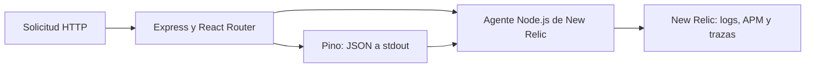

# Logging y observabilidad

## Estado y alcance

Esta estrategia está implementada en el servidor de `apps/core` (Express y React Router). La aplicación móvil requiere una estrategia propia; el agente Node.js de New Relic no se carga en Expo.

El objetivo es poder seguir una solicitud y diagnosticar un fallo sin registrar datos privados. La fuente de logs de la aplicación es Pino; el agente de New Relic está configurado para enviar esos logs y aportar APM y trazas cuando se habilite. No se necesita una tabla de logs en PostgreSQL.



## Integración

1. [logger.ts](../apps/core/src/shared/infrastructure/logger.ts) configura un único Pino con JSON a stdout, nivel `info` por defecto y `LOG_LEVEL` para cambiarlo operativamente.
2. `pnpm --dir apps/core start` precarga el agente de New Relic antes de importar el servidor. En desarrollo, `pnpm --dir apps/core dev` funciona sin el agente. `NEW_RELIC_ENABLED=false` permite arrancar sin licencia. Para habilitar APM y forwarding en producción, configurar `NEW_RELIC_ENABLED=true`, `NEW_RELIC_LICENSE_KEY` y `NEW_RELIC_APP_NAME` en el entorno; el repositorio no guarda la licencia.
3. El *application log forwarding* del agente está configurado para enviar los eventos de Pino y stdout conserva los logs del contenedor. Si la infraestructura también reenvía stdout a New Relic, configurar `NEW_RELIC_APPLICATION_LOGGING_FORWARDING_ENABLED=false` para evitar duplicados. No hay transporte HTTP propio en Pino.
4. El middleware crea un logger hijo por solicitud con un `requestId` validado o generado y lo devuelve en `x-request-id`. Al terminar registra método, ruta normalizada, estado y `durationMs`. Después de autenticar una empresa, añade su `companyId` al logger hijo. La correlación con transacciones y trazas requiere comprobación en staging.
5. El servidor, adaptadores y rutas usan eventos estructurados en lugar de `console.*`. Un fallo técnico debe quedar registrado una vez en el límite que lo maneja; las respuestas esperadas mediante `Result` no son errores de infraestructura por sí solas.

## Contrato de cada evento

Usar mensajes estables y campos planos para poder filtrar. Ejemplo ilustrativo:

```json
{"level":50,"time":1780000000000,"service":"yoyos-core","event":"order_create_failed","requestId":"8c3d...","companyId":"6af1...","errorCode":"PERSISTENCE_UNAVAILABLE","err":{"type":"Error","message":"Database unavailable","stack":"..."}}
```

| Campo | Uso |
| --- | --- |
| `event` | Nombre estable en `snake_case`, por ejemplo `order_create_failed`. |
| `requestId` | Identificador de la solicitud; también aparece en la respuesta para soporte cuando sea útil. |
| `companyId` | Solo cuando la empresa ya fue autenticada; nunca inferirla de un dato no validado. |
| `userId`, `orderId` | Identificadores cuando ayudan a investigar; evitar objetos completos. |
| `errorCode` | Código técnico o de aplicación estable, cuando exista. |
| `err` | Error real para que Pino serialice tipo, mensaje y stack. Revisar el mensaje antes de emitirlo si puede contener secretos. |
| `durationMs`, `statusCode` | Medición y resultado de solicitudes u operaciones relevantes. |

Niveles: `debug` para diagnóstico temporal; `info` para hitos relevantes; `warn` para fallos recuperables o rechazos anómalos; `error` para operaciones fallidas que requieren investigación; `fatal` para un fallo que termina el proceso. No registrar cada consulta a la base de datos ni cada paso exitoso de una operación habitual.

## Datos sensibles y aislamiento

- Registrar campos permitidos de forma explícita. Nunca emitir cuerpos HTTP completos, cabeceras, cookies, tokens, contraseñas, correos, teléfonos, nombres de clientes, mensajes de WhatsApp ni datos de pago.
- Configurar `redact` de Pino como defensa adicional para rutas conocidas de secretos, incluidas variantes anidadas. No confiar únicamente en esa lista: no cubre secretos incrustados en cadenas ni claves inesperadas.
- Evitar URL completas cuando puedan contener parámetros sensibles. Registrar una ruta normalizada; no registrar `Authorization` ni el valor bruto de `x-request-id` sin validarlo.
- Conservar `companyId` como contexto de diagnóstico sin mezclar datos entre empresas. Los logs no reemplazan las políticas de aislamiento de datos ni constituyen un registro de auditoría de acciones de negocio.
- Para envíos de correo que continúan después de responder al HTTP, observar tanto un `Result` fallido como una promesa rechazada y registrar solamente un evento saneado; la respuesta HTTP no confirma la entrega del correo.

## Validación de la implementación

- Una solicitud exitosa y una fallida producen eventos JSON con nivel, `event`, `requestId`, estado y duración; los errores inesperados conservan stack en el servidor sin devolverlo al cliente.
- La prueba unitaria de `logger.ts` comprueba que valores señuelo de tokens, cabeceras y datos personales no aparecen en stdout. Repetirla en staging para comprobar los registros recibidos por New Relic.
- En staging, comprobar que un evento de prueba aparece **una vez** en New Relic y queda asociado a la transacción/traza correspondiente (`trace.id` y `span.id`).
- La aplicación sigue funcionando si New Relic no está disponible; el logging no debe bloquear solicitudes ni operaciones de negocio.

## Referencias

- [Pino: API, logger hijo y redacción](https://github.com/pinojs/pino/blob/main/docs/api.md) · [salida legible en desarrollo](https://github.com/pinojs/pino/blob/main/docs/pretty.md).
- [New Relic: instalación del agente Node.js](https://docs.newrelic.com/docs/agents/nodejs-agent/installation-configuration/install-maintain-nodejs/) · [logs en contexto para Node.js y Pino](https://docs.newrelic.com/docs/logs/logs-context/configure-logs-context-nodejs/).
