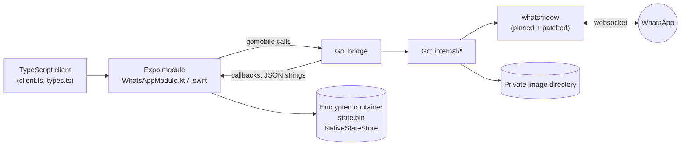
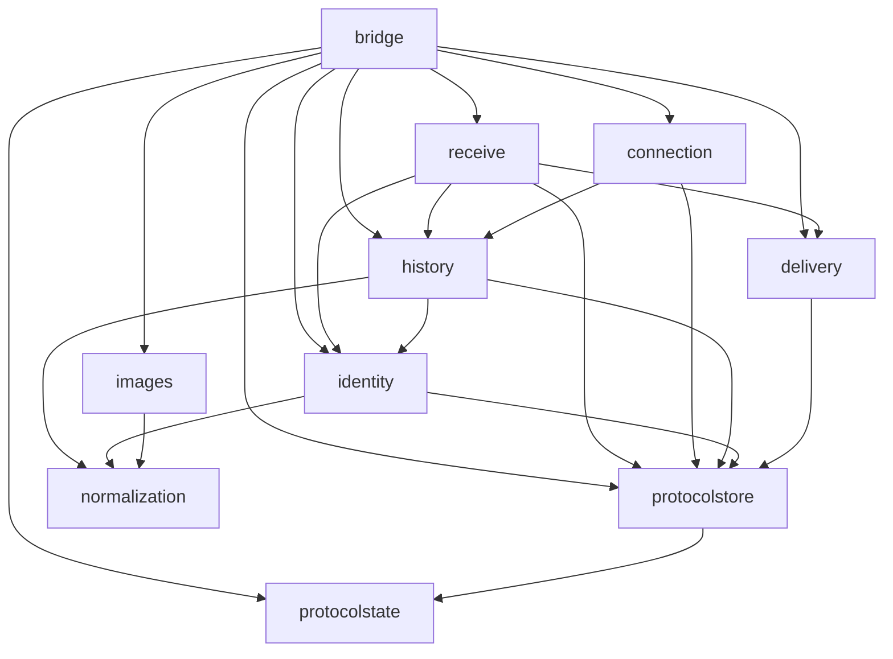
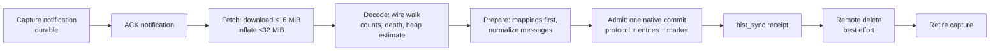
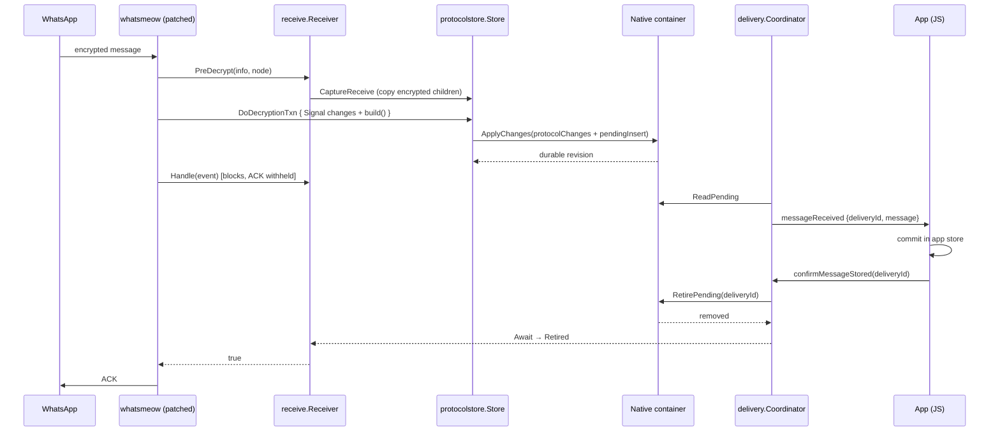

# WhatsApp Go library architecture

This document describes the Go library that powers the mobile WhatsApp receiver: the module at `apps/mobile/modules/whatsapp/go` (Go module `yoyos-whatsapp`). It explains how the code is layered, what each package owns, how the main flows work, and the invariants that hold the design together.

For the public TypeScript API, configuration, guarantees, evidence and per-task history (WA-01 … WA-14), see [`apps/mobile/modules/whatsapp/README.md`](../apps/mobile/modules/whatsapp/README.md). For the original design proposal (in Spanish), see [`whatsmeow-go-expo-implementation.md`](whatsmeow-go-expo-implementation.md).

> **Status.** The Go code is tested with `go test -race` and `go vet` against controlled transports and in-memory doubles of the native storage. It has not been run against the real WhatsApp service or on a physical device.

## 1. Purpose and boundaries

The library links [whatsmeow](https://github.com/tulir/whatsmeow) into the Expo app through `gomobile bind` and gives the app a **durable, ordered, confirmable stream of received WhatsApp text and image messages**.

What it does:

- Links a device by QR, keeps the connection, reconnects and logs out.
- Receives live messages and history syncs, decrypts them on the phone and normalizes them into a stable JSON shape.
- Commits protocol state and received content **atomically**, through the native encrypted container.
- Hands messages to JavaScript one at a time and acknowledges them to WhatsApp only after the app confirms it stored them.
- Downloads, verifies and deletes private image files under a byte budget.

What it deliberately does **not** do:

- Send WhatsApp messages, upload anything to core, open a listening port or use an HTTP client of its own.
- Persist anything by itself. Go holds no files except images; all session and pending state lives in the native container (Kotlin/Swift), which Go reaches through synchronous callbacks.
- Log. Go writes no logs; errors cross the boundary as fixed public codes.



## 2. Layering

The module has two levels:

| Level | Path | Role |
| --- | --- | --- |
| Boundary | `bridge/` | The only package exported to gomobile. Exposes sessions, result structs and callback interfaces using only types gomobile can bind (strings, ints, bools, pointers to structs, interfaces). Maps every internal error to a public code. |
| Core | `internal/*` | Protocol, persistence, delivery, history and image logic. Never visible to native code; `internal/` enforces that at compile time. |

The guiding rules, consistent with [`programming-style.md`](programming-style.md):

- **Only versioned JSON crosses gomobile.** Every request and response has `contractVersion: 1`. Responses are decoded strictly: unknown fields, duplicate members, trailing data, wrong key sets or oversized payloads are rejected as `STATE_INVALID`.
- **Dependencies are explicit.** Every package receives its collaborators as small interfaces (`Ledger`, `Storage`, `Transport`, `Clock`, `Network`, `Remote`, …) or hook structs. No package reaches a global or constructs its own I/O.
- **Pure where possible.** `protocolstate` and `normalization` do no I/O; `history` decoding and preparation write nothing.
- **Panics never escape.** Every native callback invocation is wrapped with `recover()` and turned into a storage or consumer failure.

### Package dependency graph



`normalization` and `protocolstate` are the leaves: they depend only on whatsmeow types. `images` knows nothing about whatsmeow; it receives the network through an interface that `bridge` adapts from `connection`.

## 3. Packages

### `bridge` — gomobile boundary

Files: `bridge.go`, `connection.go`, `delivery.go`, `identity.go`, `images.go`.

Exposes four session types, each opened by a function that returns a `*…Result{Session, Code}` (gomobile cannot return `(T, error)` reliably across both platforms, so errors are explicit codes):

| Session | Opened by | Owns |
| --- | --- | --- |
| `ProtocolSession` | `OpenProtocolStore` | A raw protocol store (used by tests and probes). |
| `DeliverySession` | `OpenDelivery` | The pending ledger and the single delivery coordinator. Works without a session, generation or network. |
| `ConnectionSession` | `OpenConnection` / `OpenConnectionWithDelivery` | The connection controller, the protocol store and device, the identity service and, through `AttachImages`, image downloads. |
| `ImageSession` | `OpenImages` | The private image directory and its budget. |

Native implements the callback interfaces:

| Interface | Methods | Implemented by |
| --- | --- | --- |
| `ProtocolStorage` | `ReadState`, `ApplyChanges`, `BeginFreshSession` | `NativeStateStore` |
| `DeliveryStorage` | `ReadPending`, `RetirePending` | `NativeStateStore` |
| `ConnectionEvents` | `OnConnectionEvent(json)` | `WhatsAppModule` |
| `DeliveryEvents` | `OnDelivery(json) error` | `WhatsAppModule` |

`bridge` also:

- Wires the collaborators: builds a `receive.Receiver` per connection attempt (`newTransport`), points store mapping commits at the identity service, connects the delivery coordinator's `Stop`/`Resume` hooks to the controller.
- Translates internal codes to the 19 public error codes (`publicCode`). For example, `protocolstore.UncertainCommit`, `StaleGeneration` and `SessionRevisionMismatch` all become `SESSION_STORAGE_FAILED`.
- Rebuilds the store from the last confirmed revision after a `RECOVERY_BUFFER_FULL` pause (the store is latched after a capacity stop).
- Offers `ValidateProtocolChange`, a pure function native may call before taking its writer lock.

### `internal/connection` — connection lifecycle

Files: `controller.go`, `whatsmeow.go`, `history.go`, `media.go`, `suspend.go`, `logout.go`.

`Controller` owns **one requested connection** and is a state machine over the public states `disconnected`, `connecting`, `awaitingQr`, `connected`, `reconnecting`, `sessionExpired`.

Key ideas:

- **Generations.** Each attempt runs under a numeric generation. Retiring an attempt (disconnect, pause, suspend, logout, local fault) increments it, so late QR codes, state changes or download results of an old attempt are discarded instead of published.
- **Transport abstraction.** `Transport{Run(ctx, chan<- TransportEvent); Stop()}` hides whatsmeow. `NewWhatsmeowTransport` builds the real one; tests use a fake. The factory `create func() (Transport, error)` is called per attempt, outside the controller lock, because building it reads native state.
- **Deadlines and retries.** An attempt must make progress within 30 s (the deadline is suspended while waiting for a QR scan). A paired session retries with backoff `1, 2, 4, 8, 16, 30` s; an unpaired one ends the request instead.
- **Faults.** `FailLocal(code)` ends the request with the first local fault (later ones are ignored). `Notify(code)` publishes an informational error without changing state (`IDENTITY_UNAVAILABLE`, `HISTORY_LIMIT_REACHED`, …).
- **Capacity pause.** `PauseForCapacity` stops the transport but keeps the request; `ResumeCapacity` builds a new attempt once the coordinator reports enough freed space. `RequestActive()` lets native tell a pause from an ended request.
- **Suspend/Resume** (iOS). `Suspend` retires the generation and remembers that a connection was requested; `Resume` starts exactly one new attempt with fresh deadlines. Nothing is received while suspended.
- **Logout.** `Logout(prepare)` invalidates the generation, runs `prepare` (identity resolution) and asks WhatsApp to unlink through a dedicated unlink transport within `LogoutTimeout` (15 s). Concurrent `Connect`/`Disconnect` calls wait for it.
- **Events are delivered in order** on a dedicated goroutine (`deliver`), never while holding the controller lock. A QR event is dropped if it is no longer the current, unexpired one.

`whatsmeow.go` configures the pinned client for this receive-only, durability-first model:

```go
client.EnableAutoReconnect = false        // the controller owns reconnection
client.UseRetryMessageStore = false       // receive-only
client.EnableDecryptedEventBuffer = true  // decrypted content goes through the store
client.SynchronousAck = true              // handler result decides the ACK
client.PreDecryptMessage = receive.PreDecrypt
client.MessageReceiveFinished = receive.Finished
client.ManualHistorySyncDownload = true   // history order is ours
client.DisableManualHistorySyncReceipt = true
```

`media.go` exposes `AdmitMedia`/`AcquireMedia`/`MediaLease`: an image download is admitted against the current generation and its result can only be published while that generation is alive.

### `internal/protocolstore` — transactional whatsmeow store

Files: `store.go`, `signal.go`, `prekeys.go`, `auxiliary.go`, `recovery.go`, `receive.go`, `history.go`, `firstlink.go`, `ledger.go`, `budget.go`.

`Store` implements whatsmeow's `store.AllStores` and `DeviceContainer` over the native container instead of SQL. It keeps an in-memory copy of the session records read at `Open`, and every write goes to native as one `ApplyChanges` request:

```json
{
  "contractVersion": 1,
  "generationId": "…",
  "accountId": "…@lid",
  "expectedSessionRevision": "41",
  "protocolChanges": [{ "operation": "put", "recordType": "signal-session", "recordKey": "…", "valueBase64": "…" }],
  "pendingInserts": [ … ],
  "pendingIdentityUpdates": [ … ]
}
```

Native validates generation, account, expected revision, capacity and record shapes, then publishes **one** encrypted snapshot. Success means durable publication.

Important behaviours:

- **Decryption transaction.** `DoDecryptionTxn` stages every write made while decrypting a message (Signal session, sender keys, app-state, message secrets) together with the pending entry that carries the decrypted content. Reads inside the transaction see staged writes. One commit or none.
- **Optimistic concurrency.** Each request carries `expectedSessionRevision`; native rejects a stale one. Revisions returned must strictly increase, otherwise the result is treated as uncertain.
- **Uncertain commits.** If `ApplyChanges` panics, errors or returns an incoherent response, the store latches `UNCERTAIN_COMMIT`, drops its cache and re-reads native state. A latched store refuses further reads and writes (`StopReason()`), and the connection stops.
- **Receive capture.** `CaptureReceive` (called from `PreDecrypt`) copies every encrypted child and its metadata before Signal state advances, and installs a `ReceiveBuilder` that normalizes the plaintext inside the transaction.
- **Ownership rules.** Outgoing operations return `OUTGOING_UNSUPPORTED`; `DeleteDevice` returns `NATIVE_LOGOUT_REQUIRED` because native owns credential retirement.
- **First link.** `NewFirstLinkDevice` creates pairing keys in memory; after whatsmeow verifies the paired JID/LID the container calls `BeginFreshSession` so native publishes the device and the session in a single commit.
- **Ledger.** `Ledger` reads and retires pending entries through `DeliveryStorage` only — no generation, credentials or network needed — so recovery and confirmation work with an invalid session or after an account change.
- **Budget.** `EntrySize` counts the serialized entry, encryption overhead, a separator and, for `pendingLid`, an identity reserve. `Decide` admits exactly up to the limit. Image bytes never count.
- **History admission.** `AdmitHistoryBatch` commits the batch's protocol effects, all its pending inserts and a batch marker in one request.

### `internal/protocolstate` — session record codec

Files: `codec.go`, `values.go`, `device.go`. See its [`README.md`](../apps/mobile/modules/whatsapp/go/internal/protocolstate/README.md).

A pure, versioned codec for the session snapshot: `{protocolSchemaVersion: 1, records: [{recordType, recordKey, valueBase64}]}`. It defines every record type (`device`, `identity`, `signal-session`, `prekey`, `sender-key`, `app-state-*`, `contact`, `chat-setting`, `message-secret`, `privacy-token`, `lid-mapping`, `retry-hash`, …), canonical keys, strict value validation, size limits (16 MiB envelope, 2048-byte keys, JSON depth 64) and the conversion between `store.Device` and its record. It rejects any `plaintext` field: recoverable content belongs to pending entries, not to the session.

### `internal/receive` — live receive path

File: `receiver.go`.

`Receiver` plugs into the patched whatsmeow hooks:

| Hook | Receiver method | What it does |
| --- | --- | --- |
| `PreDecryptMessage` | `PreDecrypt` | Captures encrypted children before decryption (`protocolstore.CaptureReceive`). |
| inside the decryption txn | `build` | Classifies identity and normalizes the plaintext; touches no store. |
| event handler (synchronous ACK) | `Handle` | Finds the pending entry for the message and **blocks until it is retired**; returns `true` only then, which allows the ACK. |
| `MessageReceiveFinished` | `Finished` | Classifies failures: buffer full → pause (or stop if oversize), local storage → stop. |

`Handle` returns `true` immediately for a history notification (its durable capture is what the ACK needs) and `false` for content still waiting for an identity (no ACK until WhatsApp redelivers it).

### `internal/delivery` — single delivery traversal

File: `coordinator.go`.

`Coordinator` is the only place that emits `messageReceived`. It serves local recovery (entries left by a previous run) and new receptions with the same traversal:

- One delivery in flight at a time, ordered by `createdRevision` then `createdOrdinal`.
- Native pending entries are the only durable source; the coordinator keeps only the in-flight delivery in memory.
- `SetConsumer` replaces the single consumer and re-emits the in-flight delivery; `RemoveConsumer` ignores stale tokens.
- `Confirm(id)` durably retires an entry (idempotent; an absent ID succeeds) and wakes any `Await` waiting on it, which releases the protocol ACK.
- `WaitForCapacity`/`AwaitCapacity`/`CapacityFreed` resume reception or history admission only when the rejected entry would fit; they wake on retirements, never by polling.
- Stops raised through hooks (`NO_CONSUMER`, `CONSUMER_FAILED`, `READ_FAILED`) are lazy: reception stops only when a delivery actually needs a consumer.
- Entries with `identityState: pendingLid` are skipped until resolved.

### `internal/identity` — identity classification and late resolution

Files: `classify.go`, `resolver.go`, `service.go`.

WhatsApp addresses users by phone number (PN) or by LID. Public messages always use a LID-based identity.

- `Classify` / `ClassifyWeb` decide, for live and history content respectively, whether a message is `resolved`, `pendingLid` (kept, but its chat LID is not yet known) or `excluded`.
- `Resolve` reads the account's verified PN→LID mappings and publishes identity updates for pending entries of that account.
- `Service` runs resolution passes on triggers only (session open, mapping stored, content kept without identity, new `connect()`); there is no polling. It reports `IDENTITY_UNAVAILABLE` once per listener scope and calls `coordinator.Refresh` when entries become deliverable. Logout runs a final `Resolve` before credentials are retired.

### `internal/normalization` — public message shape

File: `normalization.go`. See its [`README.md`](../apps/mobile/modules/whatsapp/go/internal/normalization/README.md).

Converts a whatsmeow `events.Message` into a `ReceivedMessage`, an `UnresolvedIdentity`, or an excluded result. It defines:

- Stable IDs: `MessageID` = `wa-message:v1:` + Base64url of `[account, chat, whatsappMessageId]`; `NewDeliveryID` uses crypto randomness and checks for collisions.
- Image references: `wa-image:v1:` + Base64url JSON descriptor (sensitive: contains the media key).
- Timestamp policy: a missing or invalid timestamp means *unknown date*; the message is still delivered, without a `timestamp`.

It performs no storage, network, download or filtering by age.

### `internal/history` — atomic history batches

Files: `processor.go`, `bounded.go`, `decode.go`, `cost.go`, `prepare.go`, `limits.go`.

A history sync arrives as an encrypted notification. The live path captures it durably (as a pending entry nobody delivers) and ACKs it. `Processor` then handles one batch at a time:



- `bounded.go` cuts input while it is received and inflation while it is produced.
- `decode.go` and `cost.go` walk the protobuf on the wire, estimating parser heap (bound: 160 MiB) and checking counts and depth before `Unmarshal`; fields that admission never reads are dropped before parsing.
- `prepare.go` processes PN→LID mappings first and normalizes each message with the same rules as live content; it writes nothing.
- If the batch does not fit the recovery budget yet, it waits on `AwaitCapacity` holding no lock; if it can never fit, it is rejected.
- A batch marker makes retries after a lost receipt skip admission, so nothing is published twice.
- Rejections (`HISTORY_LIMIT_REACHED`, `RECOVERY_BUFFER_FULL`, `NATIVE_CALL_FAILED`) are reported as informational events and never stop live reception.
- `Drain` first retires captures left by other accounts (`RetireCaptures`), which could never be completed.

All limits are in `history.DefaultLimits()`; the README documents them and the measured peaks.

### `internal/images` — private image files

Files: `service.go`, `budget.go`, `descriptor.go`, `file.go`, `fs.go`, `mime.go`, `errors.go`.

`Service` downloads, verifies, reuses and deletes image files in a private directory:

- Operations (download, delete, limit change) run **one at a time in admission order**; at most 64 can be queued. `Begin*` takes a queue position without waiting so native can release its thread.
- A global byte `budget` counts every file in the directory plus the active download, at the larger of its reservation and real size. Reducing the limit never deletes files.
- `limitedFile` bounds every write path (`Write`, `WriteAt`, `Truncate`, `Allocate`); the declared length never widens the bound.
- The MIME type is sniffed from the file bytes; the descriptor's MIME is never trusted.
- A complete file is reused without network. Each download has a 60 s timeout.
- The network arrives through the `Network`/`Lease` interfaces, which `bridge` adapts from `connection.MediaLease`, so a download only publishes while its connection generation is alive.
- `FS` and `Clock` are injectable for failure tests.

### `internal` (root) — dependency probe

`probe.go` exposes `DependencyReady()`, used by `bridge.Probe` to prove the pinned whatsmeow client can be constructed on device without connecting.

## 4. Key flows

### 4.1 Live message, end to end



If anything fails before retirement (crash, failed callback, no consumer, lost confirmation), the pending entry stays and is delivered again after a restart. Delivery is **at-least-once**; consumers must be idempotent by `message.id`.

### 4.2 Opening a session

1. Native opens the container and calls `OpenDelivery(storage, sink, readBound, budget)`, then `Start()`. Recovery of existing pending entries begins, even with no session.
2. Native calls `OpenConnectionWithDelivery(...)`:
   - with an empty `accountID`, a first-link device is created in memory (QR linking);
   - otherwise the store is opened and the device restored from the `device` record.
3. The identity service is started and a resolution pass runs.
4. `Connect()` starts the first attempt.

### 4.3 Capacity pause

When an admission does not fit the recovery buffer, `Finished` receives `BUFFER_FULL` with the needed size. The controller pauses (publishes `RECOVERY_BUFFER_FULL`, state `disconnected`, request kept), and the coordinator records the needed size. Confirmations free space; when the entry would fit, the coordinator calls `Resume`, `bridge` reopens the store from the last confirmed revision, and a new attempt starts. An entry larger than the whole budget stops reception instead.

### 4.4 Logout

`ConnectionSession.Logout()` stops reception, runs `ResolveIdentities` so stored mappings are applied durably, then asks WhatsApp to unlink within 15 s. It returns `""` (confirmed), `REMOTE_LOGOUT_UNCONFIRMED`, or a storage code (nothing was retired). Native then retires the session and its key. History captures of the unlinked account are retired; real pending messages keep their `accountId` and remain confirmable.

## 5. Concurrency model

- **Locks are never held across native calls that can block on Go, nor across waits.** The controller builds transports outside its lock; the coordinator emits outside its lock; history capacity waits hold no store or writer lock.
- **Single goroutines own ordered work:** the controller's event delivery goroutine, the coordinator's traversal goroutine, the history processor's run loop, and the image service's ordered queue.
- **Receive-goroutine safety.** Stopping the whatsmeow client waits for its handler queue, so decisions made from inside a handler (pause, stop) run on separate goroutines (`callAsync`).
- **Generations and tokens** replace cancellation flags: stale work checks its generation (controller) or token (consumer) and discards itself.
- Wakeups use channels and condition variables; nothing polls.

## 6. Patched whatsmeow

The library depends on a pinned whatsmeow revision (`v0.0.0-20261006124319-9399289b022b`) plus three patches in `apps/mobile/modules/whatsapp/patches/`:

| Patch | Adds |
| --- | --- |
| `pre-decrypt-context.patch` | `PreDecryptMessage` and `MessageReceiveFinished` hooks, a single decryption transaction covering app-state and recovery writes, `store.ErrLocalStorage`, buffered-event and precommitted-protocol support. |
| `wa05-socket-ownership.patch` | Socket identity for handlers (`CurrentSocketID`), so late handlers of a closed socket cannot act on a new one. |
| `wa08-history-batch.patch` | `WithMediaDownloadLimit` (bytes actually received decide), `StageHistorySync` to apply history protocol effects inside a transaction, and manual history flags. |

Because of these patches, **do not run `go test` or `go vet` directly in `go/`**: `protocolstore` does not compile against the unpatched module in Go's cache. Use the scripts below, which apply the patches to a temporary copy.

## 7. Build and test

From the repository root:

```sh
cd apps/mobile/modules/whatsapp
./scripts/prepare-go-dependencies.sh   # explicit, pinned dependency setup
sh scripts/test-go.sh                  # go test -race ./..., go vet, patched whatsmeow tests
./scripts/build-go.sh android|ios|all  # gomobile bind → WhatsAppGo.aar / WhatsAppGo.xcframework
sh scripts/measure-go.sh               # Go-side cost snapshot (MEASUREMENTS.json)
```

- Builds use `GOTOOLCHAIN=local` and `GOPROXY=off`; they never upgrade dependencies or install SDKs.
- Android binds `arm64-v8a` and `x86_64` with Java prefix `expo.modules.whatsapp.go`; iOS binds device arm64 and simulator arm64/amd64 with Objective-C prefix `YYWhatsAppGo`.
- Any change to Go, a patch or a binding requires rebuilding the artifacts and the app; Expo Go cannot load the module.

Testing conventions inside the module:

- Tests are colocated (`*_test.go`). Fakes replace the transport (`fakewa_test.go`), the native container, the clock and the filesystem.
- Tests cite case IDs (`UT-…`, `IT-…`) so `scripts/trace-matrix.ts` can generate [`TRACEABILITY.md`](../apps/mobile/modules/whatsapp/TRACEABILITY.md).
- `bridge/security_test.go` checks that errors and panics carrying sensitive data never reach events or results, and that Go sources contain no logging.
- `bridge/binding_names_test.go` guards names that would collide with generated Java/Objective-C methods.

## 8. Extending the library

- **New public operation:** add it to `bridge` using gomobile-friendly types, return a public code (never a Go `error` with details), and update `types.ts`, `client.ts` and the native modules together. The public method set is pinned by `wa14.contract.test.ts`.
- **New persisted protocol data:** add a record type to `protocolstate` (key components, versioned value, validation), implement the store method in `protocolstore`, and update the native writer's validation.
- **New message type:** extend `normalization` and the identity classification; check its cost against the recovery budget and the history limits.
- **New failure mode:** define an internal code, map it in `bridge.publicCode`, and decide whether it stops reception (`FailLocal`), pauses it (`PauseForCapacity`) or is informational (`Notify`).
- Keep the invariant: **nothing is acknowledged to WhatsApp before the app confirmed it stored the content, and nothing is committed partially.**
